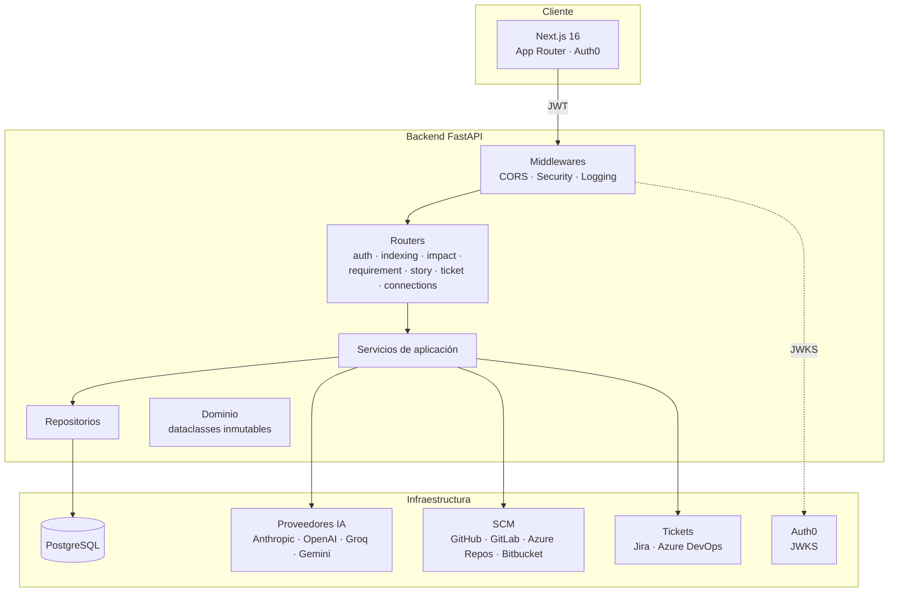
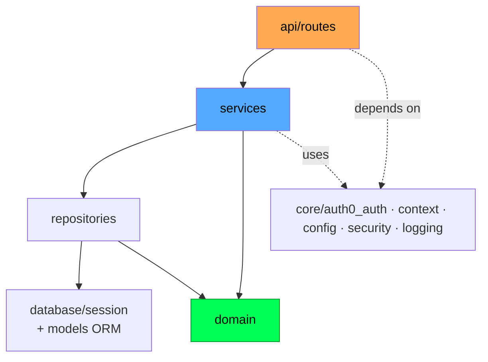
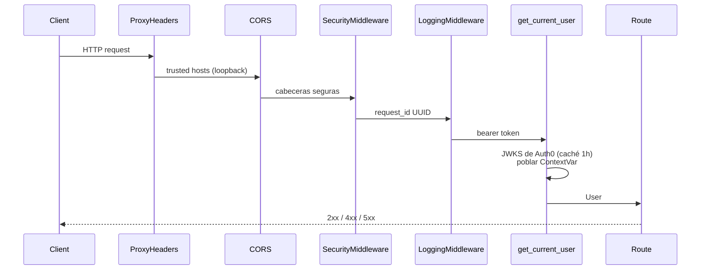
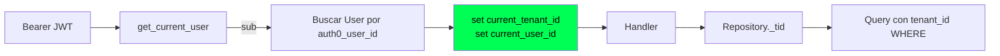
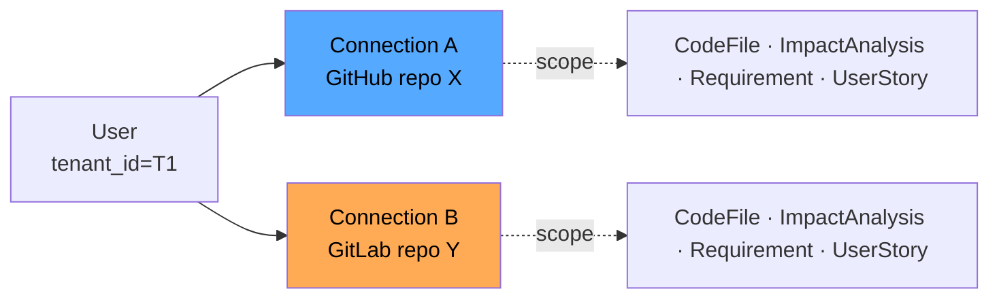
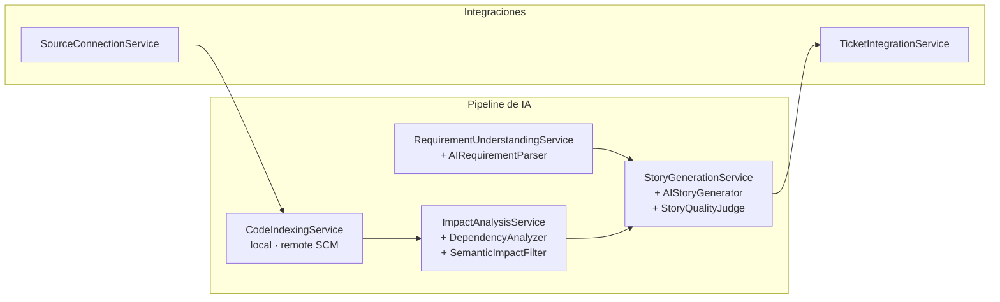
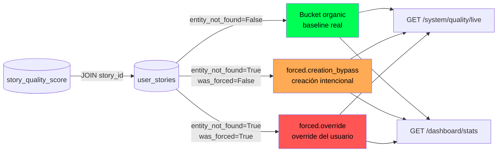
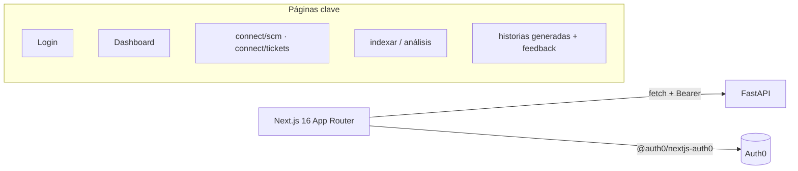
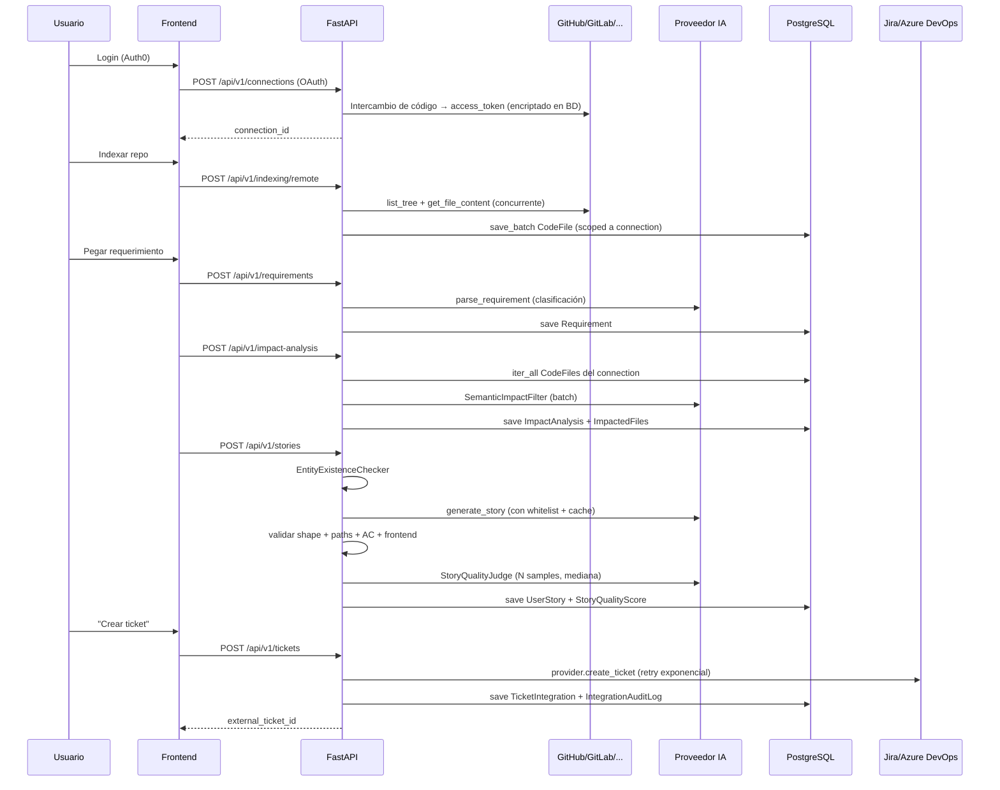

# Arquitectura — BridgeAI

BridgeAI es una plataforma SaaS multi-tenant que conecta repositorios de código y sistemas de tickets para generar **Historias de Usuario** automáticamente a partir de requerimientos en lenguaje natural. La arquitectura sigue **Clean Architecture** con una regla de dependencias estricta: las capas externas dependen de las internas, nunca al revés.

> Este documento describe la arquitectura de la aplicación. Para el modelo de datos ver [`db.md`](./db.md). Para el detalle del pipeline de IA ver [`specs/ai.md`](./specs/ai.md). Para qué significa cada métrica del dashboard y cómo leerlas ver [`metricas.md`](./metricas.md).

---

## 1. Visión general



El sistema está diseñado bajo tres principios irrenunciables:

1. **Aislamiento de tenant en el repositorio**: cada query del data layer adjunta `tenant_id` desde un `ContextVar` poblado por el middleware de autenticación. Una query sin contexto **falla**, no devuelve datos cruzados.
2. **Aislamiento por conexión SCM**: dentro de un mismo tenant, archivos, requerimientos, análisis e historias se aíslan también por `source_connection_id` para evitar mezclar repos de un mismo usuario.
3. **Composición por puertos y adaptadores**: proveedores de IA, SCM y tickets son intercambiables vía interfaz abstracta; el servicio nunca conoce al proveedor concreto.

---

## 2. Capas y regla de dependencias



| Capa | Responsabilidad | Restricciones |
|---|---|---|
| `app/domain/` | Dataclasses inmutables (`@dataclass(frozen=True)`) que modelan conceptos del negocio | **Cero** imports de FastAPI, SQLAlchemy o librerías externas |
| `app/services/` | Casos de uso, lógica de orquestación, validación funcional | Inyectan `Settings` y repositorios; jamás importan rutas ni middleware |
| `app/repositories/` | Acceso a datos y aplicación de aislamiento por tenant + conexión | Cada método llama `_tid()` que delega en `get_tenant_id()` |
| `app/api/routes/` | Endpoints HTTP, DTO Pydantic, conversión a/desde dominio | Inyectan servicios vía `Depends`; no contienen reglas de negocio |
| `app/database/` | `Base` declarativa, `engine`, `SessionLocal`, `get_db()` | Único punto que conoce SQLAlchemy a nivel infraestructural |
| `app/core/` | Cross-cutting: config, logging, seguridad, autenticación, contexto | Imports cortos y estables |
| `app/models/` | ORM SQLAlchemy 2.0 (`Mapped[...]`) con FKs e índices | Heredan de `Base`; se importan en `app/main.py` para registrarse en `Base.metadata` |

### 2.1 Bootstrap (`app/main.py`)

`create_app()` es la **app factory**: en entornos de test se usa `TestClient(create_app())` para obtener una instancia limpia. El orden de los middlewares es intencional:



---

## 3. Multi-tenant y `ContextVar`



`app/core/context.py` expone `get_tenant_id()` que **lanza `RuntimeError`** si el `ContextVar` no está seteado. Esto convierte un fallo de autenticación en un error explícito en lugar de una fuga silenciosa de datos: imposible que un repositorio se ejecute sin contexto.

> Detalle del flujo JWT, JWKS, provisioning y modos de fallo en [`specs/auth.md`](./specs/auth.md).

---

## 4. Aislamiento por conexión (Phase 7)

Dentro de un mismo tenant un usuario puede tener N conexiones SCM (GitHub repo A, GitLab repo B…). `CodeFile`, `ImpactAnalysis`, `Requirement` y `UserStory` están **scopeados por `source_connection_id`** además de por tenant, con índices compuestos `(tenant_id, source_connection_id, …)`.



Implicaciones:

- Indexar el repo Y nunca pisa los archivos del repo X.
- El whitelist de archivos enviado al LLM en la generación de historia se construye **solo** con paths del `source_connection_id` activo.
- Borrado lógico: las conexiones se hacen *soft delete* (`deleted_at`) para preservar historial.

---

## 5. Servicios de aplicación



| Servicio | Entrada → Salida | Notas |
|---|---|---|
| `CodeIndexingService` | Repo (local o SCM remoto) → registros `CodeFile` | Hash SHA-256, batch save, concurrencia con `ThreadPoolExecutor`, eliminación de stale paths. Detalle de qué se indexa, qué se almacena y qué viaja al LLM en [`specs/indexacion.md`](./specs/indexacion.md) |
| `RequirementUnderstandingService` | Texto libre → `Requirement` clasificado | Sanitización anti-prompt-injection, caché por `(hash, project, connection)` |
| `ImpactAnalysisService` | Requerimiento → `ImpactAnalysis` + lista de archivos impactados | Scan keyword + AST imports + filtro semántico LLM + grafo de dependencias |
| `StoryGenerationService` | `requirement_id` + `analysis_id` → `UserStory` | Validación de existencia de entidad, whitelist de paths, retry inteligente. Marca `entity_not_found=True` cuando el usuario fuerza la generación sobre un requerimiento incoherente — ver §5.1 |
| `TicketIntegrationService` | `UserStory` + provider → `TicketIntegration` | Idempotencia, retry exponencial, audit log con payload + response |
| `SourceConnectionService` | OAuth callback / PAT → `SourceConnection` | Encriptación de tokens, audit log de eventos |

> Detalle de los flujos: [`specs/integraciones-scm.md`](./specs/integraciones-scm.md) (GitHub/GitLab/Azure Repos/Bitbucket + OAuth + PAT + Fernet) y [`specs/integracion-tickets.md`](./specs/integracion-tickets.md) (Jira + Azure DevOps + idempotencia + retry exponencial + audit).

### 5.1 Partición de métricas: orgánico vs forzado (con sub-corte por origen)

Cuando el `EntityExistenceChecker` detecta que la entidad principal del requerimiento no aparece en el codebase, la generación se rechaza por defecto (HTTP 422). El usuario puede mandar `force=true` para forzarla; el sistema también bypassea el chequeo automáticamente cuando la acción es un verbo de creación (`create`, `add`, `crear`…). Cualquiera de las dos vías persiste `user_stories.entity_not_found=True`, pero **no son lo mismo** — la creación intencional es legítima, el override del usuario es input degradado real.

Para distinguirlas, el dominio persiste también `user_stories.was_forced` (el flag `force` del request). El `StoryQualityJudge` recibe `entity_not_found` y aplica caps duros (completeness ≤3, specificity ≤4, feasibility ≤4) — esas notas bajas son **esperadas** por diseño, no un fallo. Las métricas agregadas se parten para que no contaminen el baseline:



- **Repositorio** (`StoryQualityRepository.summary_since`) emite tres buckets (`organic`, `forced`, `all`) en una sola query con `CASE`; dentro de `forced` reporta `creation_bypass_count` y `override_count`. Portátil PG/SQLite.
- **Endpoint live** `GET /api/v1/system/quality/live?days=N` devuelve `{window_days, organic, forced, all}` con `avg_overall`, `count` y `avg_dispersion` por bucket.
- **Dashboard** (`GET /api/v1/dashboard/stats`) consume el mismo `summary_since` y expone:
  - Funnel completo en row 1: Requirements → Análisis → Historias → Tickets (cuatro KPIs).
  - Calidad partida en row 2: *Calidad orgánica* y *Calidad forzada* (con meta "X por creación · Y override"), junto a Aprobación (con chips 👍/👎 absolutos) y Conversión.
- El endpoint legado `GET /api/v1/system/quality` sigue sirviendo `eval_report.json` del harness offline — fuente distinta.

---

## 6. Patrón de proveedores intercambiables

Tres familias de adaptadores siguen el mismo patrón ABC + factoría:

```mermaid
classDiagram
    class AIProvider {
        <<abstract>>
        +parse_requirement(text) dict
    }
    AIProvider <|-- StubAIProvider
    AIProvider <|-- AnthropicAIProvider
    AIProvider <|-- OpenAIAIProvider
    AIProvider <|-- GeminiAIProvider

    class StoryAIProvider {
        <<abstract>>
        +generate_story(context) dict
        +repair_acceptance_criteria(story, reason, lang)
    }
    StoryAIProvider <|-- StubStoryProvider
    StoryAIProvider <|-- AnthropicStoryProvider
    StoryAIProvider <|-- OpenAIStoryProvider
    StoryAIProvider <|-- GeminiStoryProvider

    class ScmProvider {
        <<abstract>>
        +list_tree(token, repo, branch)
        +get_file_content(token, repo, path)
    }
    ScmProvider <|-- GitHubScmProvider
    ScmProvider <|-- GitLabScmProvider
    ScmProvider <|-- AzureReposScmProvider
    ScmProvider <|-- BitbucketScmProvider

    class TicketProvider {
        <<abstract>>
        +create_ticket(payload)
    }
    TicketProvider <|-- JiraTicketProvider
    TicketProvider <|-- AzureDevOpsTicketProvider
```



La selección del adaptador se hace en factorías cacheadas (`get_ai_provider`, `get_story_ai_provider`, `get_quality_judge`) leyendo `Settings.AI_PROVIDER`. Cambiar de proveedor es un cambio de variable de entorno, no de código.

---

## 7. Configuración

`app/core/config.py` define una única clase `Settings` (`pydantic-settings`) con `@lru_cache`. Carga `.env` + `.env.{APP_ENV}` (overlay), siendo `APP_ENV` por defecto `local`. **Nunca** se instancia directamente: siempre vía `get_settings()`.

Variables relevantes (ver [`CLAUDE.md`](../CLAUDE.md) para la lista completa):

- `DATABASE_URL` — PostgreSQL único soportado
- `AI_PROVIDER` / `AI_MODEL` — selecciona proveedor y modelo
- `AI_JUDGE_*` — controla el LLM-as-Judge (provider, samples, temperature)
- `AUTH0_DOMAIN` / `AUTH0_AUDIENCE` — validación JWT
- `FIELD_ENCRYPTION_KEY` — Fernet para encriptar tokens OAuth (obligatorio en prod)
- `TRUSTED_PROXY_IPS` — IPs autorizadas a setear `X-Forwarded-*`
- `CORS_ORIGINS` / `CORS_ORIGIN_REGEX` — orígenes permitidos

---

## 8. Seguridad

| Vector | Mitigación |
|---|---|
| Cross-tenant data leak | `ContextVar` + `_tid()` en cada repository; query sin contexto = `RuntimeError` |
| Prompt injection en requerimientos | Lista negra (`ignore previous`, `system:`, `<\|`, `\|\|`) + cap de 2000 chars |
| Alucinación de paths en historias | Whitelist exhaustiva en el prompt + validación post-respuesta + retry con feedback al modelo |
| Token leak en BD | Tipo `EncryptedText` (Fernet) para `access_token` / `refresh_token` en `source_connections` |
| JWT spoofing | JWKS de Auth0 con caché de 1h, validación de `aud` e `iss` |
| Header injection vía proxy | `ProxyHeadersMiddleware` restringido a `TRUSTED_PROXY_IPS` (loopback por defecto) |
| Pérdida de auditoría tras borrado de conexión | `connection_audit_logs.connection_id` es plain string (no FK); audit logs sobreviven al delete |

`app/core/security.py` añade `SecurityMiddleware` con cabeceras (`X-Frame-Options`, `X-Content-Type-Options`, `Referrer-Policy`, `Strict-Transport-Security`).

> Profundización: [`specs/auth.md`](./specs/auth.md) cubre JWT/JWKS y el contrato de `ContextVar`; [`specs/integraciones-scm.md`](./specs/integraciones-scm.md) cubre la encriptación Fernet de tokens y la validación anti-SSRF de `base_url`.

---

## 9. Frontend

Stack: **Next.js 16 (App Router) + TypeScript + Tailwind + shadcn/ui**, autenticación con Auth0 SDK, i18n y dark mode.



> Nota operacional: en Next.js 16 no se usa `middleware.ts` (usar `proxy.ts`) y **no** se añade la clave `eslint` a `next.config.ts`. Estas reglas están en la memoria del proyecto.

---

## 10. Flujo end-to-end



---

## 11. Testing

- `tests/unit/` — Unitarias por capa (servicios, repositories, providers con stubs).
- `tests/integration/` — `TestClient(create_app())`, BD real PostgreSQL.
- `tests/e2e/` — Playwright contra el frontend Next.js.
- Convención: cualquier test que toque persistencia se ejecuta con un usuario autenticado simulado para que el `ContextVar` esté seteado.

---

## 12. Migraciones (Alembic)

Las migraciones viven en `alembic/versions/`. Patrón:

```bash
python -m alembic revision --autogenerate -m "descripcion"
python -m alembic upgrade head
```

Hitos relevantes:

- `a3f9d2c1b845` — multi-tenant basado en usuario
- `b7e4f3a2c910` — migración Clerk → Auth0
- `c3f1a2b4d567` / `d8a1c3f5e912` — `source_connection_id` en code_files / stories / analysis / requirements (Phase 7)
- `b5e2c3d4f901` — encriptación Fernet de tokens
- `a03dd37be40a` — `story_feedback` y `story_quality_score`
- `a1b2c3d4e5f6` / `b2c3d4e5f6a7` — preservar historial y soft-delete en connections

---

## 13. Estado del roadmap

| Fase | Feature | Estado |
|---|---|---|
| 1 | Code Indexing | ✅ |
| 2 | Impact Analysis | ✅ |
| 3 | Requirement Understanding (LLM) | ✅ |
| 4 | Story Generation | ✅ |
| 5a/5b | Jira integration + hardening | ✅ |
| 5c | Azure DevOps integration | ✅ |
| 6 | Frontend Next.js 16 | ✅ |
| 7 | Repository isolation | ✅ |
