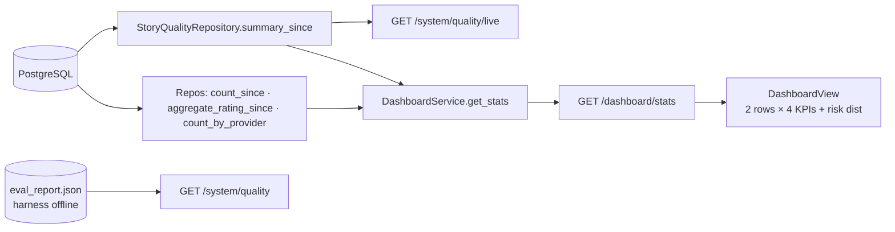

# Guía de métricas — BridgeAI

Esta guía cubre **qué métricas expone el producto, cómo se generan, cómo leerlas y qué decisiones tomar a partir de ellas**. Es la referencia operativa para mirar el dashboard, consumir los endpoints, o investigar números raros.

> Para el modelo de datos subyacente ver [`db.md`](./db.md). Para la arquitectura general ver [`arquitectura.md`](./arquitectura.md).

---

## 1. Vista general

BridgeAI expone métricas en dos planos:

1. **Dashboard del producto** (`GET /api/v1/dashboard/stats`) — KPIs operativos para el usuario (orientados a "cómo voy"). Multi-tenant, scope automático por `tenant_id` desde el JWT de Auth0.
2. **Endpoint de calidad en vivo** (`GET /api/v1/system/quality/live?days=N`) — agregaciones puras de las notas del juez, partidas en buckets. Ideal para dashboards admin/observabilidad.

Hay un tercer endpoint, **`/api/v1/system/quality`**, que es distinto: lee `eval_report.json` producido por el harness offline (`tests/eval/`). No es vivo, no se mezcla con los anteriores.



Toda agregación pasa por un repository que hace `WHERE tenant_id = :tid`. Una historia de otro tenant **nunca** entra en tu agregado — el `_tid()` lanza `RuntimeError` si el `ContextVar` está vacío.

---

## 2. Cómo se generan los números

### Ventana temporal

Casi todas las métricas aceptan un parámetro de ventana:

| Endpoint | Parámetro | Default | Rango |
|---|---|---|---|
| `/dashboard/stats` | `window_days` | sin filtro (todo el histórico) | `>=0`; `0` o ausente = sin filtro |
| `/system/quality/live` | `days` | `30` | clamped a `[1, 365]` |

`window_days=null` en la respuesta del dashboard significa "todo el histórico". Cualquier valor positivo aplica `WHERE created_at >= NOW() - interval`.

### Patrón de query: agregación con CASE

La calidad se parte en buckets sin múltiples queries. El repositorio (`app/repositories/story_quality_repository.py:summary_since`) ejecuta:

```sql
SELECT
  AVG(CASE WHEN us.entity_not_found = false THEN sqs.overall END) AS organic_avg,
  AVG(CASE WHEN us.entity_not_found = true  THEN sqs.overall END) AS forced_avg,
  COUNT(CASE WHEN us.entity_not_found = false THEN 1 END)         AS organic_count,
  COUNT(CASE WHEN us.entity_not_found = true  THEN 1 END)         AS forced_count,
  COUNT(CASE WHEN us.entity_not_found = true  AND us.was_forced = false THEN 1 END) AS creation_bypass_count,
  COUNT(CASE WHEN us.entity_not_found = true  AND us.was_forced = true  THEN 1 END) AS override_count,
  AVG(sqs.overall) AS all_avg,
  COUNT(*)         AS all_count
FROM story_quality_score sqs
JOIN user_stories us
  ON us.id = sqs.story_id
 AND us.tenant_id = sqs.tenant_id
WHERE sqs.tenant_id = :tid
  AND sqs.evaluated_at >= :since;
```

Tres detalles importantes:

- **Doble tenant check** (lado score y lado story) para defensa en profundidad.
- **`AVG()` ignora NULLs**, así que el `CASE` sin `ELSE` produce el filtro correcto sin contaminar el promedio del bucket contrario.
- **Portátil PG/SQLite** (los tests usan SQLite in-memory).

---

## 3. Funnel — Requirements → Análisis → Historias → Tickets

**Dónde se ven:** Row 1 del dashboard, cuatro KPIs.

```
+-------------+ +-------------+ +-------------+ +-------------+
| Requerim.   | | Análisis    | | Historias   | | Tickets     |
| 27          | | 21          | | 18          | |  6          |
+-------------+ +-------------+ +-------------+ +-------------+
```

### Cómo se computa cada uno

| Campo | Repo + método | Cuenta… |
|---|---|---|
| `requirements_count` | `RequirementRepository.count_since` | filas en `requirements` (un requerimiento entendido por el LLM) |
| `impact_analyses_count` | `ImpactAnalysisRepository.count_since` | filas en `impact_analysis` (un análisis de impacto generado) |
| `stories_count` | `UserStoryRepository.count_since` | filas en `user_stories` (una historia generada) |
| `tickets_count` | `TicketIntegrationRepository.count_successful_since` | filas en `ticket_integrations` con `status='CREATED'` |
| `tickets_failed_count` | `TicketIntegrationRepository.count_failed_since` | filas con `status='FAILED'` (token expirado, proveedor caído, project_key inválido, etc.) |
| `avg_generation_time_seconds` | `UserStoryRepository.avg_generation_time_since` | promedio de `user_stories.generation_time_seconds` — termómetro de performance del LLM |

### Cómo leerlo

El funnel se lee de izquierda a derecha. Cada paso debería tener menos o igual cantidad que el anterior. Las brechas te dicen dónde se pierde valor:

| Patrón | Diagnóstico | Acción |
|---|---|---|
| `req >> análisis` (gran caída) | El usuario pega requerimientos pero no llega a correr el análisis (paso lento, no entiende el flujo, error en el medio) | Revisar fricción de UX entre los dos pasos; logs de errores en `/impact-analysis` |
| `análisis ≈ historias` | Buena conversión: cada análisis se aprovecha | OK |
| `análisis >> historias` (gran caída) | Análisis termina pero la historia no se genera (rechazo por entity_not_found, error del LLM, usuario abandona) | Cruzar con calidad forzada/override y con logs de `EntityNotFoundError` (HTTP 422) |
| `historias >> tickets` (caída fuerte) | El usuario genera historias pero rara vez crea tickets | Falta integración configurada, historias percibidas como malas, o caso de uso solo de "preview" |

### Conversion rate

`conversion_rate` = `stories_with_tickets / stories_count`. Aparece como KPI propio en row 2 ("Conversión"). Es **una sola etapa del funnel** (historia → ticket); el resto se lee de las cifras crudas. Si querés un % entre etapas adicionales, hacés la división mental sobre los counts de row 1.

### Ratios entre etapas (cards de row 1)

Cada card downstream del funnel muestra el % conversión desde la etapa anterior en su línea de meta:

- **Análisis**: `{n}% de requerimientos` cuando `requirements_count > 0`.
- **Historias generadas**: `{n}% de análisis · X.Xs avg` — combina ratio + latencia promedio del LLM. Cuando hay solo uno de los dos, muestra solo ese.
- **Tickets**: cuando `tickets_failed_count > 0`, el meta cambia a chips `✓ N · ✗ M` (señal operativa). Cuando todo es éxito, muestra el proveedor configurado.

### Tasa de fallo de tickets

`tickets_failed_count` no aparece como KPI propio para no saturar el grid; en cambio, se materializa como **chip discreto** en el meta de la card Tickets cuando hay valor > 0. Útil porque un fallo silencioso de Jira/Azure no dispara una alerta — el dashboard lo hace visible. Si ves que sube semana a semana sin razón aparente: revisá el token o el status del proveedor.

### Tiempo de generación

`avg_generation_time_seconds` es el promedio del wall-clock de la llamada al LLM por historia. Lecturas:

| Rango | Lectura |
|---|---|
| < 5s | Modelo rápido (Haiku, GPT-4o-mini) — todo bien. |
| 5–15s | Razonable para Sonnet/GPT-4o. |
| 15–30s | Lento; revisá si el prompt se está inflando (whitelist crecida, retry-loop activo). |
| > 30s | Patológico. Probable rate-limit, modelo cargado, o explosión de tokens. Mirar logs `TOKEN_USAGE`. |

---

## 4. Feedback — aprobación con conteos absolutos

**Dónde se ve:** card "Aprobación" en row 2.

```
+----------------------+
| Aprobación           |
| 78%                  |
| 👍 142 · 👎 40       |
+----------------------+
```

### Cómo se computa

Todo viene de `StoryFeedbackRepository.aggregate_rating_since(since)` que devuelve `{thumbs_up, thumbs_down, total}`:

| Campo del DTO | Cálculo |
|---|---|
| `feedback_total` | `thumbs_up + thumbs_down` |
| `feedback_thumbs_up` | conteo crudo |
| `feedback_thumbs_down` | conteo crudo |
| `feedback_approval_rate` | `thumbs_up / total` (None si total=0) |

### Cómo leerlo

El **porcentaje solo no alcanza** — depende del volumen. Reglas de lectura:

| Volumen (`feedback_total`) | Cómo interpretar el `approval_rate` |
|---|---|
| 0–4 votos | Anecdótico. No tomes decisiones. |
| 5–20 votos | Indicativo. Un cambio de 10% puede ser ruido. |
| 20–100 votos | Confiable para tendencias. Investigá si baja de 60%. |
| 100+ votos | Muy confiable. Cambios de 5% ya merecen revisión. |

Las **chips absolutas** (`👍 N · 👎 M`) cumplen esa función — un 50% con 4 votos es muy distinto a un 50% con 200, y el chip lo deja claro de un vistazo.

### Acciones según patrones

- **Approval bajo + thumbs_down alto en absoluto:** abrir la vista admin `GET /api/v1/feedback/comments?rating=thumbs_down` (admin-only) para leer comentarios y priorizar mejoras.
- **Approval alto pero volumen ínfimo:** la métrica no es accionable; faltaría incentivar al usuario a votar. No es una señal de "todo está bien".
- **Aumento de thumbs_down semana a semana:** posible regresión post-deploy. Cruzar con la fecha de los tickets/feedback.

---

## 5. Calidad del juez — orgánica vs forzada (con sub-corte)

Aquí está el corazón de la guía. Lo que hoy funciona depende de entender **por qué** las notas se parten.

### Por qué hay buckets

El `StoryQualityJudge` (LLM-as-judge) puntúa cada historia en 5 dimensiones (completeness, specificity, feasibility, risk_coverage, language_consistency) y un `overall`. **Pero cuando la historia se generó sobre un requerimiento incoherente, el juez aplica caps duros por diseño** (completeness ≤3, specificity ≤4, feasibility ≤4) — eso garantiza que un input degradado no produzca una nota inflada. Esas notas bajas son **esperadas**, no un fallo del sistema.

Mezclar esas notas con las orgánicas distorsiona el agregado: el dashboard mostraría un promedio "bajo" que es en realidad la suma de "calidad real del pipeline" + "input degradado por diseño".

### Los cuatro estados de una historia

| `entity_not_found` | `was_forced` | Bucket | Significado |
|---|---|---|---|
| `false` | `false` | `organic` | Generación normal — entidad existe en el codebase |
| `true` | `false` | `forced.creation_bypass` | Verbo de creación (`crear`, `add`, `create`…) — sistema bypassea el chequeo intencionalmente |
| `true` | `true` | `forced.override` | Usuario pasó `force=true` sobre un requerimiento incoherente |
| `false` | `true` | (cuenta como organic) | "Force innecesario" — el usuario pasó force, pero la entidad sí estaba; UX smell |

El servicio que decide está en `app/services/story_generation_service.py:84-100`. Una historia con `force=true` y entidad encontrada NO se considera forzada — sí se persiste `was_forced=True` para poder detectar el caso "force innecesario" después.

### KPIs del dashboard

Row 2 muestra dos KPIs derivados de la misma query:

```
+--------------------+ +--------------------+
| Calidad orgánica   | | Calidad forzada    |
| 8.4                | | 4.7                |
| 18 evaluadas       | | 5 por creación · 2 |
|                    | | override           |
+--------------------+ +--------------------+
```

**Calidad orgánica** = `quality_avg_organic` (promedio del bucket organic). Es la **métrica de salud real del pipeline**. Es el número que mirás para decir "el LLM produce historias buenas".

**Calidad forzada** = `quality_avg_forced` (promedio del bucket forced, mezcla de creación + override). Las dos sub-cifras del meta vienen de `quality_count_creation_bypass` y `quality_count_override`. Te dicen **de dónde viene** la nota baja.

### Cómo leer la calidad orgánica

| Rango `quality_avg_organic` | Lectura |
|---|---|
| `null` (sin evaluaciones) | No hay datos. Generá historias y corré `POST /stories/{id}/quality/evaluate`. |
| ≥ 8.0 | Pipeline saludable. Pequeñas optimizaciones marginales. |
| 6.5–8.0 | Aceptable. Abrí el desglose de dimensiones para detectar puntos débiles consistentes (¿siempre baja en `risk_coverage`?). |
| 5.0–6.5 | Problema sistémico. Revisar el prompt de `AIStoryGenerator`, el modelo configurado, la calidad del whitelist. |
| < 5.0 | Algo está fundamentalmente roto: prompt corrupto, modelo equivocado, ENTITY_VALIDATION_MODE mal configurado. Investigá ya. |

Importante: este número **no incluye** las historias forzadas, así que un valor bajo aquí es señal real, no contaminación por inputs degradados.

### Desglose por dimensión (panel colapsable)

Debajo de los KPIs hay un botón "Ver desglose" que abre el promedio de cada una de las 5 dimensiones del juez sobre el bucket orgánico:

| Dimensión | Qué mide | Si está consistentemente bajo |
|---|---|---|
| **Completeness** | Si la historia incluye todos los campos esperados (AC, subtasks, DoD, risk_notes) y con suficiente detalle | El LLM está omitiendo secciones — revisar prompt, considerar respuesta más estructurada |
| **Specificity** | Qué tan concretos son los AC y los nombres en subtasks (versus vagos) | Reforzar en el prompt los ejemplos de AC válidos vs inválidos |
| **Feasibility** | Si la historia parece implementable como un sprint chunk | Probable: el LLM genera trabajo demasiado abstracto o demasiado grande — pedir descomposición |
| **Risk coverage** | Cuántos riesgos relevantes (regresión, performance, seguridad) menciona en `risk_notes` | El LLM no enumera riesgos por su cuenta — añadir lista de riesgos a considerar al prompt |
| **Language consistency** | El idioma del output coincide con el `language` del request | Posible mezcla de idiomas; el LLM cambia a inglés a mitad de respuesta |

**Por qué solo el bucket orgánico:** las forzadas tienen caps duros aplicados por el juez en completeness/specificity/feasibility (≤3, ≤4, ≤4) — agregarlas distorsionaría la señal de "dónde mejorar el prompt". Si querés ver dimensiones bajo input degradado, ese es trabajo de futuro.

### Force innecesario (UX smell)

Cuando una historia se persiste con `was_forced=True` pero `entity_not_found=False` (la entidad sí estaba en el codebase), el `force=true` del request fue **innecesario**. Se surface como una segunda línea en el meta de la card "Calidad orgánica" — solo cuando el count > 0:

```
Calidad orgánica
8.4
24 evaluadas
2 con force innecesario   ← chip cuando aparece
```

Lecturas:

- **0 con force innecesario**: nada que ver. No se muestra el chip.
- **1–3 ocasionales**: el usuario descubrió la opción `force=true` y la probó. Sin acción.
- **>5 con frecuencia**: el `EntityExistenceChecker` está marcando entidades existentes como ausentes (heurística de matching demasiado estricta), o el frontend está enviando `force=true` por default sin que el usuario lo decida.

### Cómo leer la calidad forzada

La nota acá *está* deprimida por diseño (los caps). Lo que importa es **cuánto** y **de dónde**:

| Patrón | Diagnóstico |
|---|---|
| `creation_bypass` >> `override` | La mayoría de las "forzadas" son creaciones legítimas. Esperás caps, las notas bajas son saludables (no inventan paths, no completan AC con detalle implementacional). |
| `override` >> `creation_bypass` | Los usuarios están empujando inputs malos. Si el avg es muy bajo, considerá agregar fricción en la UI ("¿estás seguro?"). Si el avg es decente, el feature funciona como válvula de seguridad. |
| `override` con avg < 4.0 | El usuario fuerza pero el LLM produce algo prácticamente inservible. La feature de force está siendo abusada para casos sin sentido. |
| `override` con avg ≈ 6.0 | El usuario sabe lo que hace; está forzando casos que el chequeo de entidad detectó como "no coincide" pero que en realidad eran válidos (e.g., variación de nombre). Posible mejora del checker. |

### El bucket `all` y `quality_avg_overall`

`quality_avg_overall` (campo legacy) es la mezcla. **Hoy NO se pinta en el dashboard** — quedó en el DTO para retrocompat, pero el headline ahora es `quality_avg_organic`. Si necesitás el promedio global mezclado, usá `/system/quality/live` que sí lo expone explícitamente como `all`.

### Endpoint de calidad en vivo

```bash
curl -H "Authorization: Bearer $TOKEN" \
  "http://localhost:8000/api/v1/system/quality/live?days=30"
```

Respuesta:

```json
{
  "window_days": 30,
  "organic": {
    "avg_overall": 8.4,
    "count": 18,
    "avg_dispersion": 0.42
  },
  "forced": {
    "avg_overall": 4.7,
    "count": 7,
    "avg_dispersion": 0.81,
    "creation_bypass_count": 5,
    "override_count": 2
  },
  "all": {
    "avg_overall": 7.4,
    "count": 25,
    "avg_dispersion": 0.55
  }
}
```

`avg_dispersion` es el promedio de la desviación estándar entre muestras del juez (cuando `AI_JUDGE_SAMPLES > 1`). Un dispersión alta significa que el juez se contradice entre evaluaciones — la nota promedio es menos confiable.

---

## 6. Distribución de riesgo

**Dónde:** sección "Distribución de riesgo" debajo de los KPIs.

```
LOW   ████████████████░░░  18
MED   ███████░░░░░░░░░░░░   8
HIGH  ██░░░░░░░░░░░░░░░░░   2
```

`stories_by_risk` viene de `UserStoryRepository.count_by_risk_since` agrupando por la columna `risk_level`. El `risk_level` se asigna durante el análisis de impacto:

- `LOW`: `files_impacted < 3`
- `MEDIUM`: `3 ≤ files_impacted ≤ 10`
- `HIGH`: `files_impacted > 10`

### Cómo leerlo

El balance esperado depende del producto. Una distribución muy sesgada a `HIGH` sugiere que los usuarios traen requerimientos demasiado grandes (deberían partirse antes); muy sesgada a `LOW` puede indicar que están subutilizando la capacidad de análisis (cambios triviales que no necesitan análisis).

---

## 7. Patrones de lectura combinada

Las métricas individuales rara vez son accionables solas. Algunos patrones útiles:

### "El producto se siente roto"

Mirar en orden:
1. `quality_avg_organic` — ¿está bajo? Si sí, problema en el LLM/prompt.
2. `feedback_thumbs_down` (absoluto) — ¿hay queja explícita?
3. Funnel `historias → tickets` — ¿el usuario sigue confiando en lo que generamos?

Si los tres son malos: regresión sistémica. Si solo el feedback está mal: posiblemente UX y no calidad del LLM.

### "Bajo uso del producto"

Mirar:
1. `requirements_count` por ventana corta vs larga.
2. Funnel completo: ¿dónde se cae?
3. `feedback_total` — ¿la gente ni siquiera vota?

Sin uso, ninguna de las otras métricas dice nada.

### "Calidad subjetiva no coincide con la del juez"

`feedback_approval_rate` bajo + `quality_avg_organic` alto:
- El juez puntúa bien, pero el usuario no aprueba.
- Posibles causas: el juez evalúa estructura formal (AC en G/W/T, citas correctas) pero el usuario juzga utilidad operativa.
- Acción: revisar las dimensiones del juez, considerar agregar una dimensión "usefulness" o ajustar pesos.

`feedback_approval_rate` alto + `quality_avg_organic` bajo:
- Inverso. Probablemente el juez es demasiado estricto en una dimensión que al usuario no le importa.
- Acción: revisar `language_consistency` o `risk_coverage` — pueden estar tirando la nota.

### "Estamos abusando del force"

`quality_count_override` creciendo en proporción a `quality_count_organic`:
- Posible: el `EntityExistenceChecker` rechaza casos válidos.
- Acción: bajar el umbral del checker o mejorar la heurística de matching de entidades.

`quality_count_override` con `avg_overall` muy bajo:
- Los usuarios fuerzan casos sin sentido.
- Acción: agregar fricción en la UI antes de aceptar `force=true` (modal de confirmación, ejemplos de qué hacer en su lugar).

---

## 8. Endpoints, autenticación y multi-tenancy

| Endpoint | Auth | Scope | Uso |
|---|---|---|---|
| `GET /api/v1/dashboard/stats` | JWT Auth0 obligatorio | tenant del JWT | UI del producto |
| `GET /api/v1/dashboard/stats?window_days=N` | idem | idem + ventana | UI con filtro temporal |
| `GET /api/v1/dashboard/activity?limit=N` | idem | idem | feed unificado de actividad reciente |
| `GET /api/v1/feedback/comments?rating=...` | JWT Auth0 + role=admin | tenant del JWT | leer comentarios negativos |
| `GET /api/v1/system/quality/live?days=N` | JWT Auth0 obligatorio | tenant del JWT | dashboards admin / observabilidad |
| `GET /api/v1/system/quality` | JWT Auth0 obligatorio | global (archivo) | reporte del harness offline |

Cada endpoint pasa por `get_current_user` (`app/api/dependencies.py`) que valida el JWT contra JWKS de Auth0 (caché 1h), resuelve `User`, y setea `current_tenant_id` en un `ContextVar`. Cualquier query del data layer hace `WHERE tenant_id = :tid` automáticamente — un fallo de auth es `RuntimeError` antes de tocar la BD, no leak silencioso.

---

## 9. Notas operativas

- **Cero migración para partir métricas:** las columnas ya existen (`entity_not_found` desde Phase 7, `was_forced` desde la última migración). Las cifras históricas se parten correctamente sin backfill.
- **Una sola query por dashboard:** `summary_since` reemplazó dos llamadas separadas. Latencia más baja y consistencia: los buckets vienen del mismo snapshot transaccional.
- **`AI_JUDGE_SAMPLES`:** controla cuántas veces el juez evalúa la misma historia. Default `1` (rápido). Subirlo a `≥3` mejora confiabilidad pero multiplica costo y latencia. Cuando `samples > 1`, `dispersion` y `avg_dispersion` se vuelven útiles.
- **Multi-tenant duro:** ninguna agregación se calcula sin `tenant_id`. Ver §3 de `db.md` para el patrón de aislamiento.
- **Caches del juez:** `prompt_cache` ahorra tokens cuando se evalúa la misma historia repetidamente, pero no afecta los números de las métricas (es solo cost optimization).

---

## 10. Glosario rápido

| Término | Significado |
|---|---|
| **Organic** | Historia generada sobre un requerimiento donde la entidad principal existía en el codebase. Es el caso "feliz". |
| **Forced** | Historia donde `entity_not_found=True`. Hay dos sub-tipos: |
| **Creation bypass** | Sub-tipo de forced. El sistema bypaseó el chequeo automáticamente porque la acción era un verbo de creación. Es una creación legítima. |
| **Override** | Sub-tipo de forced. El usuario explícitamente mandó `force=true` sobre un requerimiento incoherente. Es input degradado real. |
| **Force innecesario** | Estado donde el usuario pasó `force=true` pero la entidad sí estaba en el codebase. La historia cuenta como organic, pero `was_forced=True` queda persistido para detectar el patrón. |
| **Cap del juez** | Límite superior que aplica el `StoryQualityJudge` a las dimensiones cuando la historia tiene `entity_not_found=True`. Por diseño. |
| **Bucket** | Un sub-conjunto de las historias agrupadas por algún criterio. Hoy: organic / forced / all. |
| **Dispersion** | Desviación estándar poblacional entre muestras del juez. Indica cuánto se contradice consigo mismo. |
| **Funnel** | La cadena Requirements → Análisis → Historias → Tickets vista como pasos sucesivos. Cada uno con su propio count en el dashboard. |
