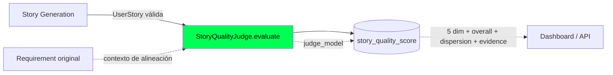
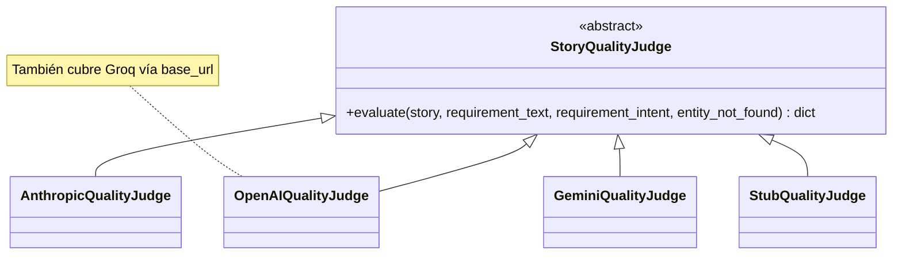
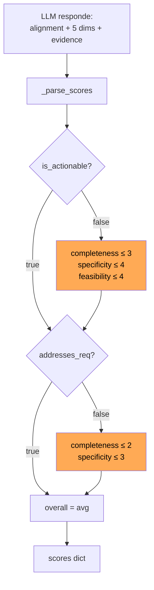
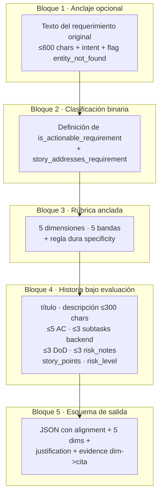
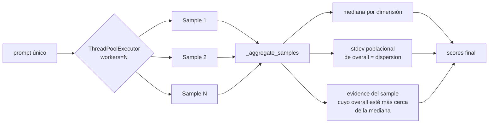
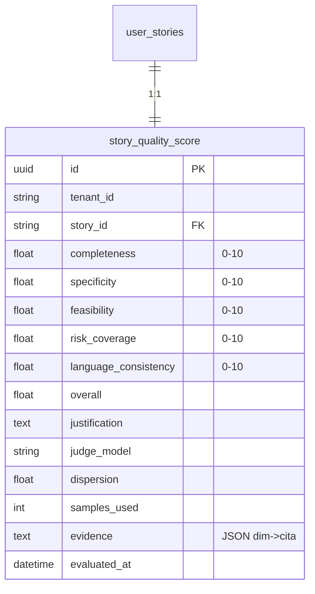

# Quality Judge — LLM-as-Judge para Historias de Usuario

Este documento describe el componente que evalúa automáticamente la calidad de cada Historia de Usuario generada por el pipeline de IA. El juez es **independiente del generador**: usa un modelo y un proveedor que se configuran por separado, escribe sus resultados en una tabla propia (`story_quality_score`) y aplica defensas anti-sesgo en código para que la nota refleje calidad real, no solo formato.

> Para el resto del pipeline de IA (Requirement Understanding, Impact Analysis, Story Generation) ver [`ai.md`](./ai.md). Para arquitectura general ver [`../arquitectura.md`](../arquitectura.md). Para la tabla `story_quality_score` ver [`../db.md`](../db.md).

---

## 1. Posición en el pipeline



El juez se invoca **después** de que el generador haya producido una historia que pasa todas las validaciones deterministas (forma, paths, AC, frontend). Su salida se persiste 1:1 con la historia y nunca bloquea la generación: una historia con score bajo se entrega igual al usuario, pero queda marcada para análisis y dashboards.

---

## 2. Configuración

| Variable | Default | Notas |
|---|---|---|
| `AI_JUDGE_ENABLED` | `true` | `false` → `StubQualityJudge` (todas las dimensiones a 7.0) |
| `AI_JUDGE_PROVIDER` | `""` | Si vacío, hereda `AI_PROVIDER`. Permite usar un modelo distinto al generador |
| `AI_JUDGE_MODEL` | `""` | Si vacío, hereda `AI_MODEL` o el default del provider |
| `AI_JUDGE_SAMPLES` | 1 | Self-consistency: N llamadas paralelas, agregación por mediana |
| `AI_JUDGE_TEMPERATURE` | 0.3 | Más alta que la generación: induce variabilidad útil cuando N>1 |
| `AI_JUDGE_MAX_TOKENS` | 1024 | Suficiente para 5 dims + evidencia + alignment + justification |
| `AI_COHERENCE_MAX_TOKENS` | 200 | Tokens para la llamada del validador de coherencia (comparte provider/model del juez) |
| `COHERENCE_VALIDATION_ENABLED` | `true` | `false` → `StubCoherenceValidator` (coherencia siempre aprobada); el heurístico sigue activo |

Patrón de despliegue común: usar **el mismo provider** que la generación pero un **modelo más fuerte** (ej. Sonnet evaluando Haiku). El juez ve menos contexto que el generador, así que el costo extra suele ser bajo.

> `AI_JUDGE_PROVIDER` y `AI_JUDGE_MODEL` se comparten entre el `StoryQualityJudge` y el `RequirementCoherenceValidator`. Ambos usan el mismo modelo pero con prompts y `max_tokens` muy distintos (el de coherencia es mucho más liviano). Si se necesita un proveedor distinto para coherencia, ajustar `COHERENCE_VALIDATION_ENABLED=false` y usar el provider del pipeline principal para esa capa.



La factoría `get_quality_judge(settings)` resuelve la implementación concreta. Si `AI_JUDGE_ENABLED=false` o el provider no es reconocido, devuelve `StubQualityJudge`.

---

## 3. Las cinco dimensiones (rúbrica anclada 0-10)

| Dimensión | Pregunta de fondo | Ejemplo de banda 9-10 |
|---|---|---|
| `completeness` | ¿La historia cubre todo lo necesario y aborda el requerimiento original? | Aborda el requerimiento + descripción + ≥3 AC verificables + DoD explícito + subtareas frontend/backend/config + notas de riesgo coherentes |
| `specificity` | ¿Los AC son verificables, concretos y en lenguaje de Product Owner? | Todos los AC en Given/When/Then con resultado observable por el usuario en términos de negocio |
| `feasibility` | ¿Es implementable en un sprint normal (1-2 semanas)? | Alcance claro, story points 1-5, riesgo bajo, subtareas atomizadas |
| `risk_coverage` | ¿Las notas de riesgo abordan riesgos técnicos relevantes? | ≥3 riesgos técnicos concretos (seguridad, performance, datos, integraciones) con mitigación |
| `language_consistency` | ¿El idioma es consistente en todos los campos? | 100% de los campos en el mismo idioma, terminología técnica coherente |

`overall = avg(5 dimensiones)` (redondeado a 2 decimales).

### 3.1 Regla dura sobre `specificity`

Si **un solo AC** contiene jerga técnica (rutas/archivos, status HTTP, métodos REST, nombres de clases/módulos/tablas, librerías o frameworks), `specificity` queda capada a un máximo de **6** aunque el formato Given/When/Then sea correcto, y el juez debe citar el fragmento ofensivo en `evidence.specificity`. Esta regla la aplica el LLM siguiendo el prompt; complementa al filtro determinista del generador (`_AC_TECHNICAL_PATTERNS`) — captura casos sutiles que las regex no atrapan.

---

## 4. Defensa anti-sesgo: clasificación binaria + caps duros en código

Los LLM-jueces tienen un **sesgo conocido**: tienden a premiar outputs bien estructurados aunque estén desconectados del input. Para neutralizarlo, antes de las 5 dimensiones el juez responde dos booleanos honestos sobre la entrada:

```json
{
  "alignment": {
    "is_actionable_requirement": true,
    "story_addresses_requirement": true
  }
}
```

| Campo | `false` cuando |
|---|---|
| `is_actionable_requirement` | El requerimiento original es una sola palabra-sustantivo, una frase sin verbo de acción claro, un nombre de campo/método aislado sin entidad de negocio plausible, o no tiene propósito de negocio entendible |
| `story_addresses_requirement` | La historia inventa un dominio distinto, completa un requerimiento vago con suposiciones no verificables, o construye algo no implícito en el texto original |

Después, **fuera del LLM**, en `_parse_scores` (`app/services/story_quality_judge.py`), se aplican caps duros:

| Caso detectado | Caps aplicados |
|---|---|
| `not is_actionable_requirement` | `completeness ≤ 3` · `specificity ≤ 4` · `feasibility ≤ 4` |
| `not story_addresses_requirement` | `completeness ≤ 2` · `specificity ≤ 3` |

El razonamiento: si **dejáramos al juez bajar él mismo las notas de las 5 dimensiones** ante un requerimiento incoherente, su sesgo le haría dudar y dar 7-8 a una historia bien formateada. Separando la decisión binaria (responde el LLM) del impacto en la nota (lo aplica el código), garantizamos que un mal alineamiento siempre se refleja en el score.



---

## 5. Anatomía del prompt

`_build_prompt` ensambla un único string con cuatro bloques (ver `app/services/story_quality_judge.py`):



### 5.1 Anclaje al requerimiento original

Cuando se llama `evaluate(story, requirement_text=..., requirement_intent=..., entity_not_found=...)` el prompt incluye un bloque inicial que ata la evaluación al texto original. Sin él, el juez puntúa solo la calidad estructural, sin chequear alineamiento.

Si `entity_not_found=True` (la historia se forzó porque la entidad no existía en el código indexado), el prompt añade una advertencia explícita: *"el usuario fue advertido y aun así forzó la creación. Si el requerimiento sigue siendo vago/no accionable, marca `is_actionable_requirement=false`; una entidad ausente no puede compensar un requerimiento débil"*. Esto evita que el juez sea condescendiente con historias forzadas sobre input pobre.

### 5.2 `evidence` solo para notas bajas

Para cada dimensión con nota **< 7**, el juez incluye una cita textual (≤120 caracteres) del AC, subtarea o nota de riesgo que justifica la banda. Las dimensiones con nota ≥7 se omiten del bloque `evidence`. Esto:

- Hace los scores **auditable**: la persona que revisa el dashboard ve por qué bajó la nota.
- Reduce tokens: solo paga citas cuando aportan valor.
- Sirve de feedback al equipo de prompt engineering del generador.

---

## 6. Self-consistency con N samples

Una sola llamada al juez es ruidosa: la misma historia puede recibir 7.0 una vez y 8.5 otra. La solución es **agregar N muestras independientes**.



Reglas de agregación (`_aggregate_samples`):

- **Mediana por dimensión** — robusta a outliers en N bajo (3-5).
- **`overall` re-calculado** desde las medianas de las dimensiones (no la mediana de los `overall` individuales).
- **`dispersion`** = stdev poblacional del `overall` entre samples; `0` si N=1. Es el proxy de confianza: dispersión alta = el juez no se pone de acuerdo consigo mismo, vale la pena revisar manualmente.
- **`evidence`** y `justification` se toman del **sample representativo** — el que tiene su `overall` más cerca de la mediana de los `overall`. Esto asegura que las citas vengan de un juicio coherente y no mezclen razonamientos contradictorios.
- **`samples_used`** se persiste por trazabilidad: si N samples solicitadas y M responden bien, queda `samples_used = M` (a veces algún sample falla por parsing).

### 6.1 Ejecución paralela

`_collect_samples` usa `ThreadPoolExecutor(max_workers=N)`. Los SDK de los providers (`anthropic`, `openai`, `google-genai`) son síncronos pero liberan el GIL durante I/O HTTP, así que threading escala ~N× en wall time. Para N=1 se hace llamada directa para evitar el overhead del executor.

Si **todas** las muestras fallan, se propaga el último error al caller.

---

## 7. Detalles por proveedor

| Provider | Notas específicas |
|---|---|
| **Anthropic** (`AnthropicQualityJudge`) | Llamada estándar `messages.create` con `temperature=AI_JUDGE_TEMPERATURE`, `max_tokens=AI_JUDGE_MAX_TOKENS`. `log_token_usage` registra prompt/completion tokens |
| **OpenAI / Groq** (`OpenAIQualityJudge`) | `chat.completions.create` con `response_format={"type": "json_object"}` para garantizar JSON. `provider_name` distingue OpenAI vs Groq en logs |
| **Gemini** (`GeminiQualityJudge`) | Reintentos manuales `[5s, 10s, 20s]` para 429/503. Detección explícita de truncamiento (`MAX_TOKENS` / `SAFETY`): si `response.text` viene vacío, lanza `ValueError` con `finish_reason` para que el caller suba `AI_JUDGE_MAX_TOKENS`. `thinking_budget=0` desactiva el modo "thinking" en flash (no aporta para esta tarea y eleva costo) |
| **Stub** (`StubQualityJudge`) | Devuelve fijo `7.0` en cada dimensión. Útil en tests, CI y dev sin claves API |

Todos los providers concretos llaman `_collect_samples(call_once, n_samples)` y luego `_aggregate_samples`, así que la lógica de robustez está centralizada en el módulo y no se duplica.

---

## 8. Modos de fallo y defensas

| Modo de fallo | Defensa |
|---|---|
| Modelo devuelve texto fuera del JSON | `extract_json` (`app/utils/json_utils.py`) extrae el primer JSON balanceado del raw text |
| Dimensión no numérica o ausente | `_parse_scores` lanza `ValueError("Judge response missing fields: …")` y la sample se descarta |
| Dimensión fuera de [0, 10] | `_clamp` corrige y emite `WARNING` con la nota original |
| `alignment` ausente o malformado | Se asume `True` para ambos (fail-open en clasificación binaria — no penalizamos al juez por no responder explícitamente) |
| Truncamiento por `max_tokens` (Gemini) | `ValueError` con `finish_reason` indicando subir `AI_JUDGE_MAX_TOKENS` |
| 429/503 transitorios (Gemini) | Backoff manual `[5s, 10s, 20s]` antes de propagar |
| Una sample de N falla | Se descarta y se sigue con las restantes; si todas fallan, propaga el último error |
| `AI_JUDGE_ENABLED=false` | `StubQualityJudge` devuelve scores neutrales (7.0); ninguna llamada a la red |

---

## 9. Persistencia: `story_quality_score`

Esquema (ver [`../db.md`](../db.md) para el ER completo):



Decisiones notables:

- **1:1 con `user_stories`** (`story_id` UNIQUE): solo hay una evaluación vigente por historia. Re-evaluar sobreescribe.
- **`judge_model`** persistido: imprescindible para A/B entre modelos jueces; permite consultas como *"qué scores dio Sonnet 4.6 vs Sonnet 4.7 sobre las historias de mayo"*.
- **`evidence` como JSON serializado** en `Text`: estructura `{"specificity": "cita...", "completeness": "cita..."}`. Solo aparecen las dimensiones con nota baja.
- **`dispersion` y `samples_used` nullable**: histórico, eran nulos antes de la migración `b9d4f7e2c815`.

---

## 10. Modos de operación

| Modo | Cuándo | Configuración |
|---|---|---|
| **Producción estándar** | Tráfico normal | `AI_JUDGE_ENABLED=true`, `AI_JUDGE_SAMPLES=1`, juez = generador |
| **Auditoría / muestreo** | Validar la calidad del propio juez antes de un cambio | `AI_JUDGE_SAMPLES=3` con `AI_JUDGE_TEMPERATURE=0.3`; revisar `dispersion` |
| **Modelo juez más fuerte** | Generador rápido + juez exigente | `AI_PROVIDER=groq`, `AI_JUDGE_PROVIDER=anthropic`, `AI_JUDGE_MODEL=claude-sonnet-4-6` |
| **Sin juez** | Coste mínimo, validar UX | `AI_JUDGE_ENABLED=false` (StubQualityJudge devuelve 7.0 fijo) |
| **Tests / CI** | Sin claves API | `AI_PROVIDER=stub`, `AI_JUDGE_ENABLED=false` (o ambos `stub`) |

---

## 11. Cómo extender el juez

### Añadir una dimensión nueva

1. Añadir la columna en `app/models/story_quality_score.py` y crear migración Alembic.
2. Sumar el nombre a la tupla `_DIMENSIONS` en `app/services/story_quality_judge.py`.
3. Añadir el bloque de rúbrica anclada (5 bandas) en `_JUDGE_PROMPT_TEMPLATE` siguiendo el formato existente.
4. Añadir el campo en el bloque "Responde ÚNICAMENTE con JSON válido" del prompt.
5. Si la dimensión necesita un cap duro por alineamiento, ajustar `_parse_scores`.
6. Actualizar el dashboard de frontend que pinta las dimensiones.

### Añadir un proveedor juez nuevo

1. Implementar la subclase de `StoryQualityJudge` siguiendo el patrón de `AnthropicQualityJudge` (un `call_once` que retorna texto crudo, delegar agregación a `_collect_samples` + `_aggregate_samples`).
2. Registrar en `get_quality_judge()` mapeando `AI_JUDGE_PROVIDER`.
3. Añadir `<NEW>_API_KEY` y `<NEW>_MODEL` a `Settings` (si no existían ya por usar el mismo provider para generación).

### Calibrar la severidad

- **Subir umbrales de las bandas** en el prompt si las notas están infladas (banda 9-10 más exigente).
- **Endurecer caps por alineamiento** si historias tangenciales siguen recibiendo 6+.
- **Subir `AI_JUDGE_SAMPLES`** y observar `dispersion` en el dashboard: si crece consistentemente → la rúbrica es ambigua, hay que reescribirla.

---

## 12. Métricas y seguimiento

Métricas que vale la pena trackear sobre `story_quality_score`:

- **Distribución de `overall`** por `judge_model` y por `generator_model`. Detecta regresiones tras cambios de prompt o modelo.
- **`dispersion` media**. Si crece, el juez está dudando más → revisar prompt.
- **% de historias con `not is_actionable_requirement` o `not story_addresses_requirement`**. Es un proxy de la calidad del input que reciben los usuarios — útil para mejorar la UI del frontend.
- **Correlación `overall` ↔ `story_feedback.rating`**. Si los usuarios votan thumbs_down a historias con overall=8, el juez está mal calibrado.
- **Tokens por evaluación** (vía `log_token_usage`): controla costo, especialmente si subes `AI_JUDGE_SAMPLES`.
