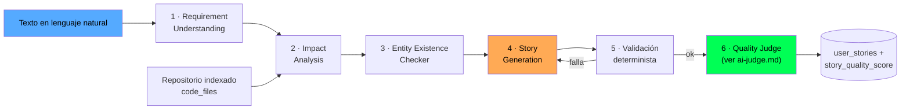
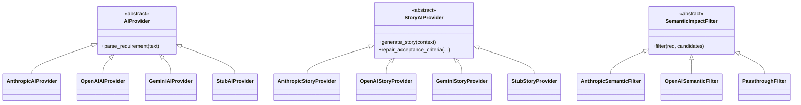
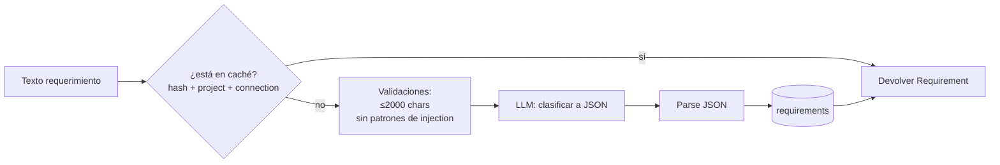
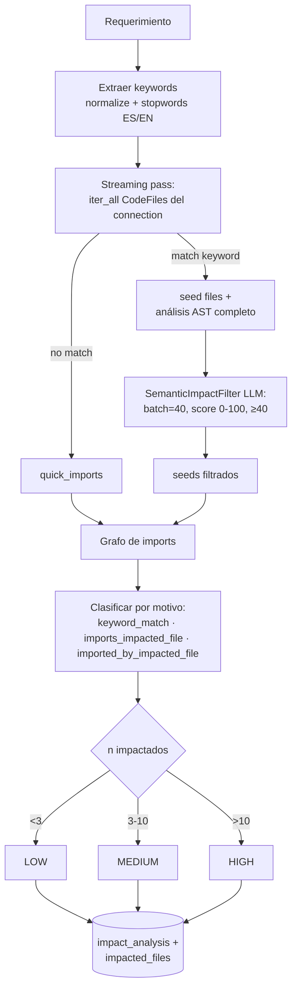
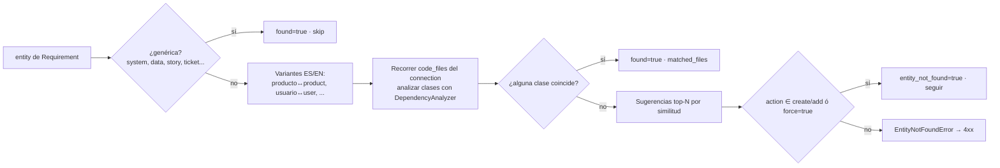
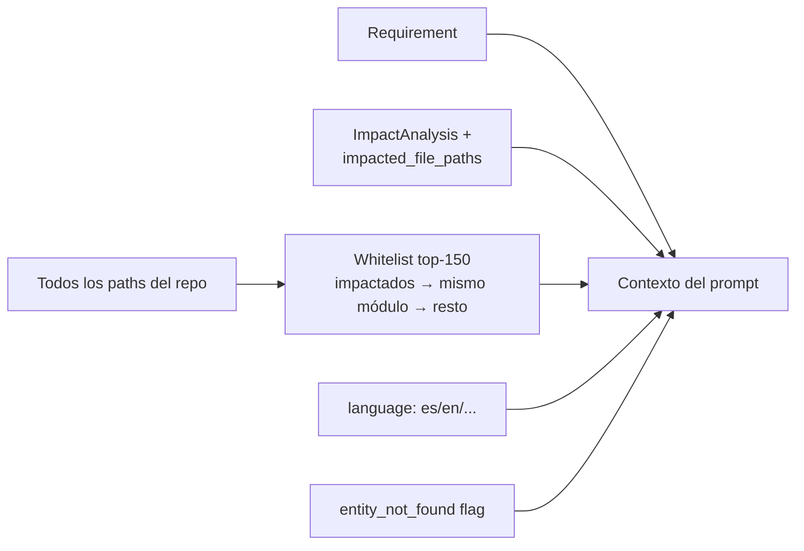
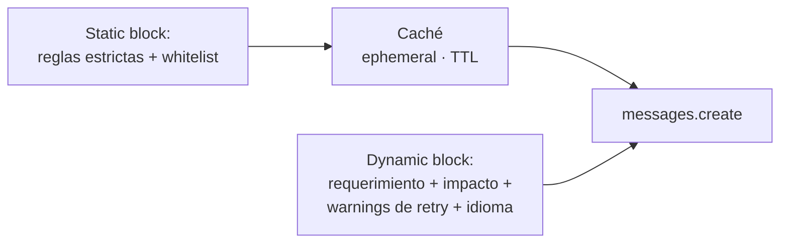
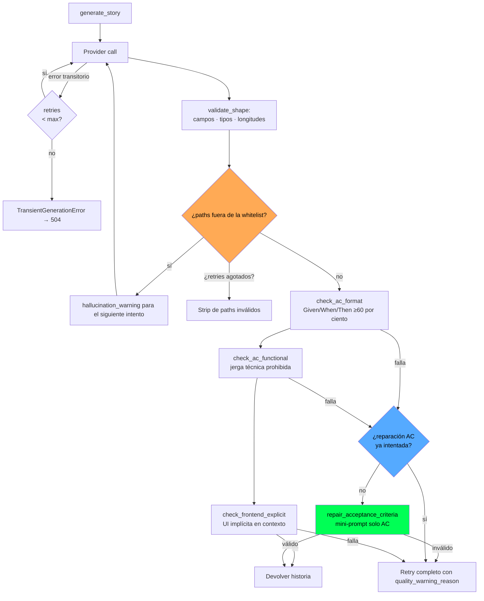

# Cómo funciona la IA en BridgeAI

Este documento describe el pipeline de IA que convierte un texto de requerimiento en una **Historia de Usuario** lista para crear como ticket en Jira o Azure DevOps. El pipeline está diseñado para ser proveedor-agnóstico y robusto frente a alucinaciones del LLM. La evaluación de calidad de cada historia se hace en un componente separado documentado aparte.

> Para la evaluación de calidad (LLM-as-Judge) ver [`ai-judge.md`](./ai-judge.md). Para la arquitectura general ver [`../arquitectura.md`](../arquitectura.md). Para el modelo de datos ver [`../db.md`](../db.md).

---

## 1. Vista general del pipeline



Este documento cubre las fases **1 a 5** (entendimiento, análisis de impacto, validación de entidad, generación de historia y validaciones deterministas). La fase 6 — el Quality Judge — está documentada en [`ai-judge.md`](./ai-judge.md).

Cada fase tiene un **proveedor IA** (Anthropic, OpenAI, Groq, Gemini o `stub`) configurable vía `Settings.AI_PROVIDER`. La selección de modelo concreto sigue la jerarquía: `AI_MODEL` (override universal) → `<PROVIDER>_MODEL` → default.

---

## 2. Proveedores y configuración



> El juez (`StoryQualityJudge`) usa el mismo patrón ABC + factoría pero se configura de forma independiente. Ver [`ai-judge.md`](./ai-judge.md).

### Variables de entorno relevantes

| Variable | Default | Notas |
|---|---|---|
| `AI_PROVIDER` | `stub` | `stub` \| `anthropic` \| `openai` \| `groq` \| `gemini` |
| `AI_MODEL` | `""` | Override universal; si está seteado pisa el modelo de cada provider |
| `AI_TIMEOUT_SECONDS` | 120 | Timeout por llamada |
| `AI_MAX_RETRIES` | 2 | Reintentos para errores transitorios + para fallos de calidad |
| `AI_MAX_OUTPUT_TOKENS` | 8192 | Generación de historia (output más grande) |
| `AI_PARSE_MAX_TOKENS` | 512 | Parsing de requerimiento (JSON pequeño) |
| `ANTHROPIC_MODEL` | `claude-haiku-4-5-20251001` | |
| `OPENAI_MODEL` | `gpt-4o-mini` | |
| `GROQ_BASE_URL` / `GROQ_MODEL` | `…/openai/v1` / `llama-3.3-70b-versatile` | Cliente OpenAI compatible apuntando a Groq |
| `GEMINI_MODEL` | `gemini-2.5-flash` | |
| `GEMINI_CACHE_TTL_SECONDS` | 0 | `>=60` activa `caches.create()` para el bloque estático |
| `ENTITY_VALIDATION_MODE` | `warn` | `warn` advierte/permite con `force`; `off` desactiva el chequeo |

> Las variables `AI_JUDGE_*` están documentadas en [`ai-judge.md`](./ai-judge.md).

---

## 3. Fase 1 — Requirement Understanding

**Servicio**: `RequirementUnderstandingService` → `AIRequirementParser` → `AIProvider.parse_requirement()`.



### Sanitización anti-injection

Antes de tocar al LLM se rechazan textos con patrones obvios:

```text
ignore previous, system:, <|, ||
```

y se cap a 2000 caracteres. Es una defensa de bajo costo; el LLM tiene también su propia robustez al jailbreak.

### Esquema de salida (validado)

```json
{
  "intent": "create_user_account",
  "action": "create",
  "entity": "user",
  "feature_type": "feature | bugfix | refactor | enhancement | configuration | performance | security",
  "priority": "low | medium | high",
  "business_domain": "authentication | billing | orders | notifications | reporting | integration | user_management | configuration | ui_ux | devops | data_management",
  "technical_scope": "backend | frontend | fullstack | infrastructure | data",
  "estimated_complexity": "LOW | MEDIUM | HIGH",
  "keywords": ["…"]
}
```

El prompt incluye reglas + few-shot en español. Idempotencia: `(tenant_id, source_connection_id, requirement_text_hash, project_id)` único en `requirements`.

---

## 4. Fase 2 — Impact Analysis

**Servicio**: `ImpactAnalysisService` con dos colaboradores: `DependencyAnalyzer` (estático) y `SemanticImpactFilter` (LLM).



Notas clave:

- **Single streaming pass**: el contenido de archivos no-seed no se retiene; solo se analiza el AST en seeds para evitar acumular memoria.
- **Filtro semántico** (`AnthropicSemanticFilter` / `OpenAISemanticFilter`): pide al LLM puntuar 0-100 cada candidato y descarta los de score `<40`. Si el provider es `stub` o falla, se usa `PassthroughFilter` (mantiene todos los seeds).
- **Cap de contenido** a 50 KB por archivo durante la lectura local (`_read_capped`).
- **Resolución de imports**: implementada para Python y Java; otros lenguajes se quedan en quick scan + keyword match.
- **Risk level** se calcula sin LLM, por número de archivos impactados.

---

## 5. Fase 3 — Entity Existence Checker



Su rol: evitar generar historias sobre entidades que **no existen** en el repositorio indexado salvo que el verbo sea de creación o el usuario fuerce. Si `entity_not_found=true` se propaga al prompt de generación y al juez para que ajusten su evaluación.

`ENTITY_VALIDATION_MODE=off` desactiva esta fase entera.

---

## 6. Fase 4 — Story Generation

**Servicio**: `StoryGenerationService` → `AIStoryGenerator` → `StoryAIProvider.generate_story()`.

### 6.1 Construcción del contexto



La **whitelist** es exhaustiva: el prompt prohíbe citar paths que no estén en ella. Estrategia de selección cuando hay >150 archivos:

1. Empieza con los `impacted_file_paths` del análisis.
2. Añade hermanos del mismo directorio (mismo módulo).
3. Rellena hasta 150 con el resto del repo.

### 6.2 Prompt de generación (anatomía)

El prompt se divide en dos bloques para aprovechar **prompt caching**:



Reglas duras codificadas en el prompt (ver `_STORY_STATIC_TEMPLATE`):

1. **Prohibido inventar paths** fuera de la whitelist.
2. **Prohibido extensiones** que no aparezcan en la whitelist (`.py` si el repo es Java, etc.).
3. **AC en Given/When/Then** verificable, multilingüe, **lenguaje de Product Owner** (sin paths, status HTTP, métodos REST, nombres de clases/módulos/tablas, librerías, frameworks).
4. **Subtareas frontend** obligatorias si la historia involucra UI; vacío `[]` si es puramente backend.
5. Tres categorías de subtareas: `frontend`, `backend`, `configuration`. Cada una con `title` (≤150 chars) y `description` (≥30 chars con qué/por qué/dónde/cómo verificar).
6. Output 100% en el `language` indicado.

### 6.3 Caché de prompt (significativo en costo)

| Provider | Mecanismo | Notas |
|---|---|---|
| Anthropic | `cache_control: ephemeral` en el primer bloque de texto | Reutiliza la whitelist gigantesca en retries por calidad/alucinación |
| Gemini | `caches.create()` keyed por `(model, sha256(static_block))` con TTL configurable | `GEMINI_CACHE_TTL_SECONDS=0` lo desactiva; fallback a uncached si `caches.create()` falla |
| OpenAI / Groq | Sin caching explícito (la API no lo expone igual) | El prompt se manda íntegro |

### 6.4 Flujo de retries y reparación quirúrgica



Tres tipos de fallo y su tratamiento:

| Error | Estrategia |
|---|---|
| `HallucinatedPathError` | Retry pasando los paths inventados al prompt como warning. Si se acaban los retries, se hace *strip* automático de los paths inválidos (preserva subtareas y descripciones). |
| `StoryQualityRetryError(kind=ac_format \| ac_functional)` | **Reparación quirúrgica**: mini-prompt que reescribe **solo** los AC. Si el resultado pasa la validación → no se hace full retry (ahorra tokens y latencia). Si falla → fallback a generación completa. |
| `StoryQualityRetryError(kind=frontend_missing)` | Full retry con warning explicando que la historia implica UI y `subtasks.frontend` no puede estar vacío. |
| Otras excepciones transitorias (`is_retryable_error`) | Retry hasta `AI_MAX_RETRIES`. Tras agotarse → `TransientGenerationError` (504). |
| Excepciones no retryables | Propaga (4xx). |

### 6.5 Validaciones funcionales — guardrail anti-jerga en AC

Patrones que invalidan un AC (`_AC_TECHNICAL_PATTERNS`):

- Rutas con extensión conocida (`app/services/auth.py`, `frontend/components/Foo.tsx`).
- Carpetas típicas de código (`app/`, `src/`, `lib/`, `services/`, `routes/`, `models/`, `migrations/`…).
- Códigos HTTP (`responde 201`, `devuelve 404`).
- Métodos REST + endpoint (`POST /api/users`).
- Endpoints `/api/...`, `/v1/...`.

Esto fuerza a que el AC se lea como un Product Owner lo escribiría, no como un developer.

### 6.6 Detección de UI implícita

`_UI_KEYWORD_PATTERN` busca términos como `formulario`, `pantalla`, `dashboard`, `modal`, `register`, `login`, `página`… en `requirement_text + intent + feature_type + keywords`. Si dispara y `subtasks.frontend` está vacío → retry con warning explícito.

---

## 7. Fase 5 — Quality Judge

Tras pasar todas las validaciones deterministas, la historia se evalúa con un **LLM-as-Judge** independiente: cinco dimensiones (0-10), clasificación binaria de alineación al requerimiento, caps duros aplicados en código contra el sesgo del juez, y self-consistency con N samples agregadas por mediana.

**Esa fase está documentada en [`ai-judge.md`](./ai-judge.md)** (rúbrica, prompt, defensas anti-sesgo, agregación, persistencia y modos de operación).

---

## 8. Robustez frente al modelo

| Modo de fallo | Defensa |
|---|---|
| Modelo devuelve texto fuera del JSON | `extract_json` (en `app/utils/json_utils.py`) extrae el primer JSON balanceado del raw text |
| Truncamiento por `max_tokens` | Cada provider detecta su `stop_reason`/`finish_reason` (`max_tokens` Anthropic, `length` OpenAI, `MAX_TOKENS` Gemini) y lanza `ValueError` indicando subir `AI_MAX_OUTPUT_TOKENS` |
| Caché Gemini expirada server-side | One-shot retry uncached invalidando la entrada local |
| Provider de Anthropic con SDK retries | Se desactivan (`max_retries=0`) para no multiplicar el wall time por 3 — el retry loop nuestro es la única fuente de verdad |
| Errores transitorios Gemini 429/503 | Backoff manual `[5s, 10s, 20s]` antes de delegar al retry de capa superior |
| Provider de filtrado semántico falla | Mantenemos todos los seeds (degradación elegante) |

---

## 9. Observabilidad

- `RequestLoggingMiddleware` añade un `request_id` UUID por petición.
- `log_token_usage` (en `app/utils/token_logging.py`) registra prompt/completion tokens y model por cada llamada relevante: `parse_requirement`, `story_gen`, `ac_repair`, `judge`, `semantic_filter`.
- Cada fase emite `INFO` con duraciones (`Scan+AST pass`, `Semantic filter`, `Dependency graph`, `Persist`) y métricas de retry.
- `generation_time_seconds` y `processing_time_seconds` se persisten en BD.

---

## 10. Modos de operación

| Modo | Cuándo usarlo | Cómo |
|---|---|---|
| **Producción** | Tráfico real | `AI_PROVIDER` real + juez activo (ver [`ai-judge.md`](./ai-judge.md)) |
| **Stub** | Tests, CI, dev sin claves API | `AI_PROVIDER=stub` — devuelve respuestas fijas en todas las fases |
| **Cost-saving** | Validar UX sin gastar | `AI_PROVIDER=groq` (latencia y costo bajos), juez desactivado |
| **Cache amistoso (Gemini)** | Whitelists grandes con muchos retries | `GEMINI_CACHE_TTL_SECONDS=300` (mín. 60) |

> Modos específicos del juez (auditoría, modelo juez más fuerte, etc.) en [`ai-judge.md`](./ai-judge.md).

---

## 11. Cómo extender el pipeline

### Añadir un proveedor de IA nuevo

1. Implementar la(s) clase(s) abstracta(s) (`AIProvider`, `StoryAIProvider`, `SemanticImpactFilter`) en su archivo. Para extender el juez ver [`ai-judge.md`](./ai-judge.md).
2. Registrarlo en la factoría correspondiente (`get_ai_provider`, `get_story_ai_provider`, `get_semantic_filter`).
3. Añadir variables `<NEW>_API_KEY`, `<NEW>_MODEL` a `Settings`.
4. Actualizar el README/`.env.example`.

### Cambiar el formato del prompt de generación

Editar `app/services/story_ai_provider.py`:

- `_STORY_STATIC_TEMPLATE` — reglas y whitelist (parte cacheable, modificarla invalida el caché).
- `_STORY_DYNAMIC_TEMPLATE` — contexto + warnings + esquema de salida.
- Si cambias el esquema de salida también ajusta `AIStoryGenerator._validate_shape` y los repos que serializan/deserializan.

### Endurecer la validación de AC

Añadir patrones a `_AC_TECHNICAL_PATTERNS` en `app/services/ai_story_generator.py`. Mantener perfil conservador (preferir falsos negativos a falsos positivos) — un AC válido bloqueado fuerza un retry caro innecesario.

---

## 12. Métricas operativas

Cada historia persiste:

- `generation_time_seconds` — wall time del provider call.
- `generator_model` — modelo concreto usado.
- `entity_not_found` — flag para excluir historias forzadas en métricas de calidad.

`story_feedback` (`thumbs_up`/`thumbs_down` + comentario) cierra el loop con la opinión humana, que puede correlacionarse con el `overall` del juez para validar su calibrado.

> Métricas específicas del juez (distribución de `overall`, `dispersion`, alineamiento) en [`ai-judge.md`](./ai-judge.md).
