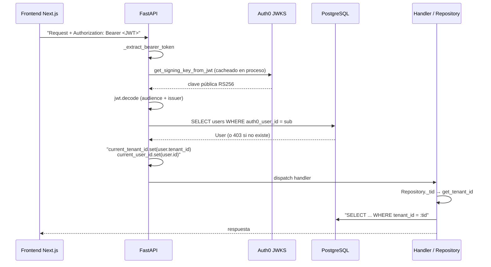
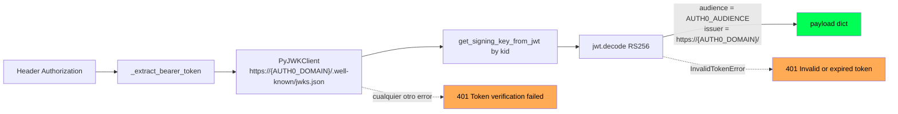
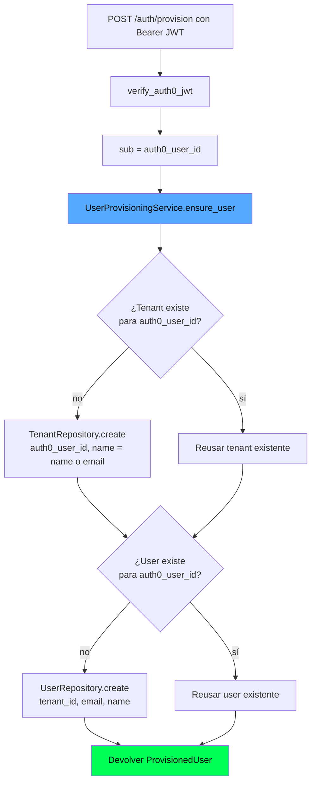
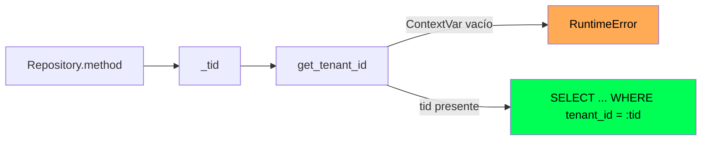

# Autenticación, JWT y multi-tenancy

BridgeAI delega la identidad en **Auth0** y construye sobre ese cimiento dos propiedades irrenunciables: cada request autenticada queda atada a un **tenant** y a un **user** mediante `ContextVar`, y cualquier consulta al data layer que se ejecute sin ese contexto **falla en lugar de devolver datos cruzados**. Este documento describe ese flujo end-to-end.

> Para la arquitectura general ver [`../arquitectura.md`](../arquitectura.md). Para las tablas `tenants` y `users` ver [`../db.md`](../db.md). Para las integraciones SCM (que usan endpoints públicos por diseño) ver [`integraciones-scm.md`](./integraciones-scm.md).

---

## 1. Visión general



Un solo middleware de seguridad (`get_current_user`) cumple cuatro tareas a la vez: valida el JWT, resuelve el `User` en BD, popla el `ContextVar` y devuelve el objeto al handler. Todo lo demás (rutas, servicios, repositorios) confía en ese contrato.

---

## 2. Validación del JWT

**Archivo**: `app/core/auth0_auth.py`.



### 2.1 JWKS y rotación de claves

`PyJWKClient` se construye una sola vez por proceso (singleton perezoso `_jwks_client`), con `cache_keys=True` y `max_cached_keys=16`. La librería:

- Descarga el JWKS la primera vez que ve un `kid`.
- Cachea las claves en memoria.
- **Auto-refresca** cuando llega un token con un `kid` que no está en caché — ése es el camino estándar de rotación: Auth0 publica la nueva clave en JWKS y el primer request con la nueva firma fuerza el refetch.

Implicación operativa: una rotación en Auth0 no requiere reiniciar el proceso, pero **sí** requiere conectividad a `https://{AUTH0_DOMAIN}/.well-known/jwks.json`. Si el endpoint cae, todos los tokens cuyas claves no estén ya cacheadas son rechazados con 401.

### 2.2 Claims validados

| Claim | Validación | Origen |
|---|---|---|
| `sub` | Debe estar presente y no vacío (lo verifica `get_current_user`) | Auth0, identifica al usuario |
| `aud` | `=== settings.AUTH0_AUDIENCE` | API audience configurada en el dashboard |
| `iss` | `=== https://{AUTH0_DOMAIN}/` | Tenant de Auth0 |
| `exp` | Validado por `jwt.decode` | Expiración estándar |
| `nbf` / `iat` | Validados por `jwt.decode` (si presentes) | Estándar |

No se aplica skew tolerance explícito; `PyJWT` usa el default de la librería. No se usan scopes ni roles propios de Auth0 — los roles internos de BridgeAI viven en `users.role`.

### 2.3 Modos de fallo

| Caso | Status | Mensaje |
|---|---|---|
| Sin header `Authorization` o sin prefijo `Bearer ` | 401 | `Missing or invalid Authorization header` |
| Token expirado, audience/issuer mal, firma incorrecta | 401 | `Invalid or expired token.` |
| Cualquier otro error inesperado durante la validación | 401 + log `exception` | `Token verification failed.` |
| `sub` ausente en el payload | 401 (en `get_current_user`) | `Invalid token claims` |
| Usuario aún no provisionado en BD | 403 | `User not provisioned. Call POST /api/v1/auth/provision first.` |

---

## 3. Provisioning automático en primer login

**Archivos**: `app/services/user_provisioning_service.py`, `app/api/routes/auth.py`.

El frontend llama `POST /api/v1/auth/provision` justo después del login de Auth0. La ruta es **pública** (no requiere `User` previo), pero **sí** valida el JWT — el `sub` proviene del token, no del body, así que un cliente no puede crear cuentas a nombre de otro.



### Idempotencia

`ensure_user` es **idempotente** y se llama en **cada login**, no solo en el primero. La unicidad la garantizan dos columnas con `UNIQUE`:

- `tenants.auth0_user_id` — un Auth0 user implica un único tenant personal.
- `users.auth0_user_id` — un Auth0 user implica un único `User`.

Cualquier llamada subsiguiente devuelve los mismos `tenant_id` y `user_id`.

### Acceso desde el frontend tras provisioning

Una vez provisionado, los endpoints autenticados se cubren con `Depends(get_current_user)` y devuelven `403 User not provisioned` mientras no exista el `User`. La regla de oro del frontend: **siempre llamar a `/auth/provision` antes que a cualquier endpoint con `_user` en su firma**.

---

## 4. `ContextVar` y aislamiento de tenant

**Archivo**: `app/core/context.py`.

```python
current_tenant_id: ContextVar[Optional[str]] = ContextVar("current_tenant_id", default=None)
current_user_id:   ContextVar[Optional[str]] = ContextVar("current_user_id",   default=None)
```

`get_tenant_id()` y `get_user_id()` lanzan `RuntimeError` cuando el `ContextVar` está vacío. Cada repositorio lo invoca en su `_tid()`:



### 4.1 ¿Por qué `ContextVar` y no `request.state`?

`request.state` es local a la `Request` de FastAPI. Funciona dentro del handler, pero se pierde en cualquier código que no reciba el `Request` por argumento — y BridgeAI tiene mucha lógica en servicios y repositorios que **no** lo reciben (es código de dominio, no de transporte). `ContextVar`:

- Sí se propaga automáticamente entre `await` calls (`asyncio` copia el contexto).
- Hace que un test unitario sin Request siga teniendo acceso al tenant si se setea explícitamente con `current_tenant_id.set("...")`.
- Permite que las integraciones (callbacks OAuth, jobs) que **no** son request-scoped seteen el contexto desde un origen confiable (p.ej. el `OAuthState` recuperado de BD).

### 4.2 Riesgos a vigilar

| Riesgo | Mitigación |
|---|---|
| Un `ThreadPoolExecutor` no propaga `ContextVar` automáticamente (sí lo hace `asyncio`) | Antes de usar `executor.submit()` en código que toque repositorios, capturar `ctx = copy_context()` y usar `executor.submit(ctx.run, fn, ...)`, o setear el tenant manualmente dentro de la tarea. Hoy los `ThreadPoolExecutor` del proyecto solo hacen I/O HTTP a APIs externas (SCM, IA), no consultan BD scopeada por tenant |
| Una tarea async iniciada con `asyncio.create_task` antes de que `current_tenant_id.set` corra ve `None` | No se hace en el código actual; toda la lógica scopeada vive aguas abajo del `Depends(get_current_user)` |
| Tests unitarios que prueban repositorios olvidan setear el contexto | Convención: el `conftest.py` o el test setea explícitamente `current_tenant_id.set("...")` |

---

## 5. Cómo se aplica a las rutas

**Archivo**: `app/main.py`.

`create_app()` registra una dependencia compartida `_auth = [Depends(get_current_user)]` y la aplica router por router. La política es: **todo router toca BD scopeada por tenant excepto los explícitamente públicos**.

| Router | Prefijo | Auth |
|---|---|---|
| `health` | `/` | Público (health checks) |
| `auth` | `/api/v1/auth` | El propio router valida el JWT internamente (`/auth/provision`) o usa `Depends(get_current_user)` (`/auth/me`) |
| `indexing` | `/api/v1` | `_auth` (router-level) |
| `impact_analysis` | `/api/v1` | `_auth` |
| `understand_requirement` | `/api/v1` | `_auth` |
| `story_generation` | `/api/v1` | `_auth` |
| `ticket_integration` | `/api/v1` | `_auth` |
| `dashboard` | `/api/v1` | sin dep router-level (revisar en código) |
| `connections` | `/api/v1` | **sin** dep router-level: el callback OAuth lo invocan plataformas externas sin JWT; el resto de endpoints aplica `Depends(get_current_user)` por endpoint. Ver [`integraciones-scm.md`](./integraciones-scm.md) |

Implicación: cuando se añade un router nuevo que toca BD del tenant, **debe** declararse con `dependencies=_auth` o aplicar `Depends(get_current_user)` por endpoint. Olvidarlo no rompe los tests porque las rutas siguen respondiendo, pero los repositorios fallarán con `RuntimeError` en runtime al no tener contexto.

---

## 6. Configuración

### Backend (`.env`)

| Variable | Obligatoria | Notas |
|---|---|---|
| `AUTH0_DOMAIN` | Sí | Ej. `my-tenant.eu.auth0.com`. Sin esquema, sin slash final |
| `AUTH0_AUDIENCE` | Sí | Audience configurada en el API de Auth0. Debe coincidir con la del frontend |

Si `AUTH0_DOMAIN` está vacío, las rutas autenticadas devuelven 401 al construir la URL de JWKS (`https:///.well-known/...`) — el sistema **no** arranca útil sin estas dos variables.

### Frontend (`frontend/.env.local`)

```env
AUTH0_SECRET=<long random ≥ 32 chars>
AUTH0_BASE_URL=http://localhost:3000
AUTH0_ISSUER_BASE_URL=https://my-tenant.eu.auth0.com
AUTH0_CLIENT_ID=<client id>
AUTH0_CLIENT_SECRET=<client secret>
AUTH0_AUDIENCE=https://api.bridgeai.com
```

`AUTH0_AUDIENCE` debe ser **exactamente la misma cadena** que `AUTH0_AUDIENCE` del backend. Cualquier desalineación produce 401 con `Invalid or expired token.`.

---

## 7. Errores comunes y diagnóstico

| Síntoma | Causa probable | Dónde mirar |
|---|---|---|
| 401 `Invalid or expired token.` en cada request | `AUTH0_AUDIENCE` desalineado entre FE y BE; o `AUTH0_DOMAIN` con esquema/slash; o reloj del servidor desfasado | Logs del servidor + `jwt.io` para ver el payload del token |
| 403 `User not provisioned.` tras login limpio | El frontend no llamó a `POST /auth/provision`, o lo llamó con otro JWT | Network tab del navegador |
| `RuntimeError: Tenant context not set` en logs sin 401 | Un endpoint nuevo accede a un repositorio sin `Depends(get_current_user)` | `app/main.py` y la firma del endpoint |
| Tokens nuevos rechazados intermitentemente tras una rotación | JWKS endpoint inalcanzable temporalmente | `curl https://{AUTH0_DOMAIN}/.well-known/jwks.json` desde el host del API |
| Todos los users comparten datos | Imposible si hay `tenant_id` en la query — pero síntoma de un repositorio nuevo que olvidó llamar `_tid()` | Grep de `WHERE tenant_id` en las queries del repositorio sospechoso |

---

## 8. Resumen para extender

Cuando añadas una ruta nueva que toque datos del tenant:

1. Declárala en un router que ya tenga `dependencies=_auth`, o añade `Depends(get_current_user)` al endpoint.
2. En el handler recibe `_user: User = Depends(get_current_user)` (aunque no lo uses) — dispara la inyección y popla el contexto.
3. Llama a tus repositorios normalmente; cada uno invoca `_tid()` internamente.
4. Si haces I/O concurrente que toca BD (raro), propaga `ContextVar` con `copy_context().run(...)` o setea el tenant a mano dentro del worker.

Cuando añadas un endpoint **público** (callback externo, webhook):

1. **No** declares `Depends(get_current_user)` — fallaría.
2. Recupera el contexto del tenant desde un origen confiable persistido en BD (p.ej. un `OAuthState`, un secreto firmado del webhook).
3. Llama explícitamente a `current_tenant_id.set(tid_recuperado)` antes de tocar repositorios.
4. Limpia o deja expirar el origen confiable para evitar replays.
