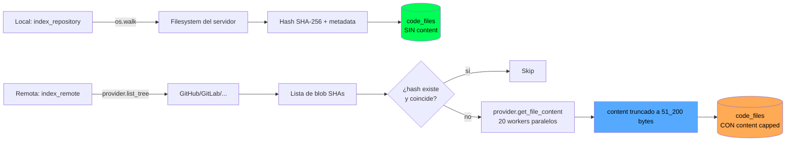
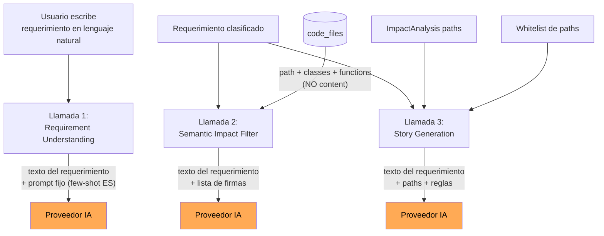
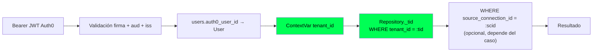

# Indexación de código y manejo de su contenido

Este documento explica **qué hace BridgeAI con el código fuente** del cliente: cómo lo lee, qué guarda, qué envía a terceros (proveedores de IA) y qué medidas mitigan los riesgos de filtración. Está pensado tanto para devs internos como para responder preguntas legítimas de clientes preocupados por la confidencialidad de su propiedad intelectual.

> Para arquitectura general ver [`../arquitectura.md`](../arquitectura.md). Para tablas `code_files`, `source_connections` ver [`../db.md`](../db.md). Para autenticación ver [`auth.md`](./auth.md), para conexión OAuth/PAT con el SCM ver [`integraciones-scm.md`](./integraciones-scm.md). Para el pipeline de IA ver [`ai.md`](./ai.md).

---

## 1. Resumen ejecutivo (TL;DR para responsables de seguridad)

> **¿Almacenan nuestro código?** Sí, parcialmente: por archivo guardamos metadata (path, lenguaje, hash, tamaño, líneas) y el contenido **truncado a los primeros 50 KB**. Esto vive en nuestra base de datos PostgreSQL, **cifrado a nivel de columna con Fernet (AES-128-CBC + HMAC)** y **aislado por tenant y por conexión**.
>
> **¿Mandan nuestro código a OpenAI/Anthropic/Google?** **No.** Lo único que sale del perímetro hacia los proveedores de IA son: rutas de archivo (`app/services/auth.py`), nombres de clases y funciones (`AuthService`, `validate_token`), y el texto que el propio usuario escribió como requerimiento. **El cuerpo del código no viaja al LLM.**
>
> **¿Quién puede ver nuestro código?** Solo cuenta del cliente con login Auth0 válido para el mismo tenant. Cross-tenant queries son técnicamente imposibles a nivel de data layer (queda detallado más abajo).
>
> **¿Y los tokens de acceso a nuestro repo?** Cifrados en la BD con Fernet (AES-128-CBC + HMAC). Si BridgeAI pierde la clave de cifrado, los tokens son inservibles — no se pueden descifrar.
>
> **¿Pueden borrar todo?** Sí. Desconectar el repo borra duro su índice de archivos. Soft-delete de la conexión preserva la trazabilidad de las historias generadas; el contenido del código se elimina.

Las secciones siguientes desarrollan cada punto.

---

## 2. Qué se indexa (y qué no)

**Archivo**: `app/services/code_indexing_service.py`.

### 2.1 Tipos de archivo aceptados

```python
DEFAULT_LANGUAGE_MAP = {
    ".py": "Python",
    ".java": "Java",
    ".js": "JavaScript",
    ".ts": "TypeScript",
    ".cs": "C#",
    ".cpp": "C++",  ".cc": "C++",  ".cxx": "C++",  ".hpp": "C++",
    ".c": "C",
    ".php": "PHP",
    ".go": "Go",
    ".rb": "Ruby",
    ".rs": "Rust",
    ".kt": "Kotlin",  ".kts": "Kotlin",
    ".swift": "Swift",
    ".scala": "Scala",
}
```

**Solo se indexan estas extensiones (14, cubriendo 14 lenguajes mainstream del top de uso empresarial: Python, Java, JavaScript, TypeScript, C#, C++, C, PHP, Go, Ruby, Rust, Kotlin, Swift, Scala).** Cualquier otro archivo (configuración, secretos en `.env`, claves SSH, dumps de BD, binarios, imágenes, documentos, archivos `.h` de C, SQL, YAML/JSON/XML, scripts shell) **se ignora silenciosamente**.

> Nota sobre `.h`: el header de C es ambiguo (puede ser C o C++) y suele contener solo declaraciones; lo mantenemos fuera. Si tu base de código C requiere indexar headers, dilo y lo añadimos como Lenguaje C.

### 2.2 Carpetas excluidas

`DEFAULT_IGNORE_PATTERNS` lista 56 patrones agrupados por familia. Estructura simplificada:

| Familia | Patrones |
|---|---|
| VCS | `.git` |
| Python (entornos y caches) | `venv`, `.venv`, `__pycache__`, `.pytest_cache`, `.tox`, `.mypy_cache`, `.ruff_cache`, `.hypothesis` |
| Cobertura (multi-lenguaje) | `coverage`, `.nyc_output`, `htmlcov` |
| JS/TS — package managers | `node_modules`, `.yarn`, `.pnpm-store`, `bower_components`, `jspm_packages` |
| JS/TS — build outputs y frameworks | `dist`, `out`, `.next`, `.nuxt`, `.expo`, `.svelte-kit`, `.astro` |
| JS/TS — herramientas de build/deploy | `.turbo`, `.parcel-cache`, `.vercel`, `.netlify` |
| JVM (Java/Kotlin/Scala) | `build`, `target`, `.gradle` |
| PHP / Go / Ruby — dependencias | `vendor` |
| Go — cache local | `pkg` |
| C# / .NET | `bin`, `obj` |
| Swift / iOS / macOS | `Pods`, `Carthage`, `.build`, `DerivedData` |
| Ruby | `.bundle` |
| CI / DevOps | `.github`, `.gitlab`, `.circleci`, `.azure`, `.husky`, `.devcontainer` |
| IDEs y asistentes IA dev | `.idea`, `.vscode`, `.vs`, `.claude`, `.cursor`, `.aider` |
| Documentación y ejemplos | `docs`, `documentation`, `examples`, `samples` |

Lo más relevante:

- **`.git`** evita procesar blobs binarios y reconstruir historial. Solo se indexa el árbol del branch activo en el momento de la indexación, nunca el historial de commits.
- **`vendor/`** captura PHP (Composer), Go (vendoring), Ruby (Bundler) — equivalentes a `node_modules`. Sin esto, indexar un repo PHP medio sube cientos de MB de dependencias al índice.
- **`bin/` y `obj/`** capturan outputs de .NET — proyectos C# típicos generan decenas de MB de basura compilada.
- **`Pods/`, `Carthage/`, `.build/`, `DerivedData/`** capturan dependencias y build outputs de iOS/macOS.
- **`docs/`, `examples/`, `samples/`** evitan ruido en el filtro semántico aunque contengan archivos del lenguaje (ej. scripts de generación de docs en Python).
- **`.github/`, `.gitlab/`, `.husky/`, `.devcontainer/`** y los caches de tooling Python (`.pytest_cache`, etc.) no contienen lógica de negocio aunque puedan tener algún script.

### 2.2.1 Lo que NO se excluye (decisiones intencionales)

| Carpeta | Por qué se mantiene indexada |
|---|---|
| `tests/`, `test/`, `__tests__/`, `spec/`, `specs/` | Si un cliente pide "agregar tests para X", el whitelist necesita poder citar paths de tests existentes. Excluirlos romperia ese caso de uso. El `ImpactAnalysisService` ya los descuenta del conteo de **módulos impactados** (ver `_EXCLUDED_MODULES` en `impact_analysis_service.py`), que es la lógica correcta — pero a nivel de indexación sí entran. |
| `migrations/`, `migration/` | Las migraciones de base de datos (Alembic, EF Core, ActiveRecord, etc.) son código importante. Cambios de schema impactan stories. |
| `tmp/`, `temp/`, `log/`, `logs/` | Nombres demasiado genéricos: módulos de negocio legítimos pueden llamarse así. Riesgo de falso positivo > beneficio. |
| `public/`, `static/`, `assets/` | Carpetas web pueden contener JS/TS legítimos (no solo activos estáticos), especialmente en frameworks SSR. |

Si un cliente concreto necesita excluir alguna de estas carpetas en su repo, el ajuste se hace inyectando `ignore_patterns` adicionales al construir `CodeIndexingService` — el campo es extensible por instancia, no requiere tocar el default.

### 2.2.1 Cómo se aplica el matching

La comparación es **por componente del path**, no por substring. Es decir, para un patrón `bin`:

| Path | ¿Se excluye? | Motivo |
|---|---|---|
| `app/bin/Foo.cs` | Sí | `bin` aparece como componente |
| `app/cabinet.py` | **No** | `bin` está dentro de `cabinet`, pero no es un componente |
| `src/binary_format.go` | **No** | mismo motivo |

Esto evita falsos positivos del estilo `targeting.go` excluyéndose por contener `target`. Implementado igual en local (`os.walk` ya separa) y remoto (split por `/` antes de comparar).

### 2.3 Indexación local vs remota



| Aspecto | Indexación local (`index_repository`) | Indexación remota (`index_remote`) |
|---|---|---|
| Origen | Filesystem del servidor (`PROJECT_ROOT`) | API del SCM (GitHub/GitLab/Azure Repos/Bitbucket) |
| Quién la usa hoy en producción | Solo desarrollo del propio BridgeAI | **Esta es la única que usan los clientes** |
| Almacena `content` | **No** | **Sí**, truncado a 50 KB (`_CONTENT_CAP = 51_200`) |
| Re-lee contenido para análisis | Sí, abriendo el archivo del filesystem cuando hace falta | No, lo lee de la BD |

**Para clientes el camino activo es siempre el remoto.** El local existe para que los devs de BridgeAI prueben contra el propio repo del proyecto.

### 2.4 Detección de cambios por hash

Cada archivo guarda su hash (SHA del blob de Git en remoto, SHA-256 en local). En sucesivas indexaciones:

- Si el hash coincide → **skip total**, no se vuelve a descargar.
- Si difiere → se descarga y se actualiza la fila.

Tras procesar todo el árbol, los paths que ya no aparecen se borran (`stale paths cleanup`). Implicación: **renombrar o borrar un archivo en el repo se refleja al re-indexar.**

---

## 3. Qué se almacena exactamente

**Tabla**: `code_files` (ver [`../db.md`](../db.md) para el ER completo).

| Columna | Contenido | Sensible |
|---|---|---|
| `id` | Auto-increment | No |
| `tenant_id` | UUID del tenant | No |
| `source_connection_id` | UUID de la conexión SCM (FK) | No |
| `file_path` | `app/services/auth.py` | Bajo (es estructura) |
| `file_name` | `auth.py` | Bajo |
| `extension`, `language` | `.py`, `Python` | No |
| `size` | Bytes del archivo en remoto | No |
| `hash` | SHA del blob en Git | Bajo |
| `lines_of_code` | Número de líneas no vacías | No |
| `indexed_at`, `last_modified` | Timestamps | No |
| **`content`** | **Primeros 50 KB del archivo** | **Alto — es el código fuente** |

### 3.1 ¿Por qué guardamos `content`?

Para que el **filtro semántico** y el **análisis de impacto** puedan parsear estructuras (clases, funciones, imports) sin volver a hacer N llamadas a la API del SCM cada vez que el usuario pega un requerimiento. Sin `content` el flujo "pegar requerimiento → ver impacto" sería mucho más lento (hablamos de cientos a miles de fetches por análisis).

### 3.2 ¿Por qué 50 KB?

- **Suficiente** para extraer estructuras: el 95%+ de los archivos de un repo típico cabe en 50 KB.
- **Acota el daño** de una eventual filtración: incluso accediendo a un archivo concreto solo vería su cabecera (imports, decoradores, primeras clases/funciones) — no el algoritmo completo si es largo.
- **Acota el coste** de almacenamiento.

### 3.3 ¿Está cifrado en la BD?

**Sí.** `content` se almacena cifrado a nivel de columna con **Fernet (AES-128-CBC + HMAC-SHA256 para integridad)** mediante el `TypeDecorator` `EncryptedText` (`app/database/encrypted_types.py`). El cifrado es transparente al servicio: SQLAlchemy descifra al leer y cifra al escribir; ningún caller ve texto cifrado.

Cuatro capas de protección, en orden:

1. **Cifrado a nivel de columna con Fernet** (esto): un dump de PostgreSQL contiene blobs `gAAAAA...` ininteligibles sin la clave.
2. **Cifrado en disco del proveedor cloud**: los volúmenes de PostgreSQL gestionado están cifrados con AES-256 por defecto.
3. **Acceso restringido a la BD**: solo el servicio tiene credenciales; no hay endpoints HTTP que devuelvan `content` crudo.
4. **Aislamiento por tenant + conexión** a nivel de query (sección 5).

La clave (`Settings.FIELD_ENCRYPTION_KEY`) vive en variable de entorno, **nunca en BD**. La misma clave protege los tokens OAuth/PAT en `source_connections` (ver [`integraciones-scm.md`](./integraciones-scm.md) §5).

> **Implicación operativa**: si la `FIELD_ENCRYPTION_KEY` se pierde, `content` se vuelve inaccesible. En la práctica el cliente reconecta el repo y re-indexa — los SCM tokens también dejarían de funcionar sin esa clave, así que es la misma dependencia que ya existía para tokens. **No es un nuevo punto de fallo, es el mismo cubriendo más superficie.**
>
> **Rollout zero-downtime**: `EncryptedText` hace passthrough con `WARNING` cuando la clave no está. Eso permite desplegar el cambio de tipo de columna primero y correr la migración (`d4f9a1c5e802_encrypt_code_file_content`) que cifra los valores existentes después, sin parada.

### 3.4 Quién lee `content` y casos extremos

#### Consumidores reales

Solo dos componentes leen `cf.content`. Ambos lo procesan **localmente** en el servidor; ninguno lo envía al LLM.

| Consumidor | Archivo:línea | Para qué |
|---|---|---|
| `ImpactAnalysisService` | `app/services/impact_analysis_service.py:73-79` | Pasa el contenido al `DependencyAnalyzer` para extraer imports/clases/funciones via AST (Python) o regex (resto). Si `cf.content` es nulo (modo local), hace fallback a leer del filesystem con `_read_capped` |
| `EntityExistenceChecker` | `app/services/entity_existence_checker.py:91-96` | Recorre las clases extraídas por el analizador para validar que la entidad principal del requerimiento (`user`, `order`…) existe en el codebase indexado |

#### Casos extremos

| Situación | Qué queda en `content` | Comportamiento aguas abajo |
|---|---|---|
| Archivo ≤ 50 KB | Contenido completo, UTF-8 | AST/regex normales |
| Archivo > 50 KB | Primeros 50 KB exactos (truncado por bytes, no por líneas) | AST/regex sobre el fragmento; suele captar imports + primeras clases/funciones, suficiente para la firma estructural |
| Archivo vacío | `""` (string vacío, no `None`) | `if cf.content` evalúa falso → análisis salta sin error |
| Archivo binario disfrazado de fuente (raro en `.py`/`.ts`/etc.) | El blob tal cual | `ast.parse` lanza `SyntaxError` → `_analyze_python` devuelve listas vacías (graceful, sin propagar excepción) |
| Indexación local (`index_repository`) | `NULL` | `ImpactAnalysisService` hace fallback al filesystem; `EntityExistenceChecker` salta el archivo (`if not cf.content: continue`) |
| Tras `DELETE /connections/{id}` | Fila borrada en hard-delete | El siguiente `SELECT` no encuentra el registro |

#### Trampa de grep — `cf.content` vs `response.content`

Si auditas el código con `grep -r "\.content" app/services` aparecen ~10 resultados en módulos de IA (`ai_provider.py`, `story_ai_provider.py`, `semantic_impact_filter.py`, `story_quality_judge.py`) **que no tocan `cf.content`**. Son referencias al campo `content` de la respuesta del SDK del proveedor de IA:

```python
# Patrón Anthropic — content es el array de bloques de la RESPUESTA del LLM
raw_text = response.content[0].text

# Patrón OpenAI — content es el campo del mensaje de RESPUESTA
raw_text = response.choices[0].message.content
```

Ningún módulo de IA importa el modelo `CodeFile` ni accede al ORM. La regla "el cuerpo del código nunca sale al LLM" se sostiene por construcción: solo `ImpactAnalysisService` y `EntityExistenceChecker` leen `cf.content`, y ninguno lo pasa a un cliente HTTP externo.

---

## 4. Qué se envía al proveedor de IA (lo que más preocupa)

Esta es la parte que más interesa a un comprador empresarial. La respuesta corta: **paths y firmas estructurales, no cuerpo de código.**

### 4.1 Las tres llamadas al LLM y su payload exacto



| Llamada | Payload completo enviado al proveedor de IA | ¿Incluye cuerpo de código? |
|---|---|---|
| **1. Requirement Understanding** (`AIRequirementParser`) | El texto del requerimiento del usuario + un prompt fijo con reglas y ejemplos few-shot. **Nada del repo.** | No |
| **2. Semantic Impact Filter** (`SemanticImpactFilter`) | El requerimiento + por cada archivo candidato: `path \| classes=[Foo, Bar] \| functions=[do_thing, helper]`. Sin cuerpo de método, sin parámetros, sin docstrings. | No |
| **3. Story Generation** (`AIStoryGenerator`) | Requerimiento + lista de paths impactados + whitelist de hasta 150 paths del repo + reglas + esquema JSON de salida. | No |

### 4.2 Cómo se construye la "firma" del filtro semántico

**Archivo**: `app/services/semantic_impact_filter.py`.

```python
def _build_signature(path: str, fa: FileAnalysis) -> str:
    parts = [path]
    if fa.classes:
        parts.append(f"classes=[{', '.join(fa.classes[:5])}]")
    if fa.functions:
        parts.append(f"functions=[{', '.join(fa.functions[:8])}]")
    return " | ".join(parts)
```

Lo que el LLM ve por cada archivo candidato es literalmente algo como:

```
app/services/auth.py | classes=[AuthService, TokenValidator] | functions=[login, logout, validate_token, refresh, _decode_jwt]
```

**Top 5 clases y top 8 funciones por archivo, por nombre.** No body, no comentarios, no constantes, no nombres de variables internas. La extracción se hace **localmente** en nuestro servidor (`DependencyAnalyzer` en `app/services/dependency_analyzer.py`).

Cobertura por lenguaje del extractor estructural:

| Lenguaje | Mecanismo | Imports | Clases / structs / etc. | Funciones / métodos |
|---|---|---|---|---|
| Python | AST nativo (`ast.parse`) | ✅ | ✅ | ✅ |
| Java | Regex | ✅ | `class`, `interface`, `enum` | Métodos con modificador `public/private/protected/static` |
| C# | Regex | ✅ | `class`, `interface`, `enum`, `struct`, `record` | Métodos con modificador C# |
| C++ | Regex | `#include` | `class`, `struct`, `union` | Métodos con modificador (los definidos fuera con `Foo::bar` se omiten — limitación conocida) |
| C | Regex | `#include` | `struct`, `union`, `enum` | Funciones top-level con cuerpo |
| PHP | Regex | `use` | `class`, `interface`, `trait`, `enum` | `function` |
| Ruby | Regex | `require`, `require_relative` | `class`, `module` | `def` (incluye `def self.x`) |
| Rust | Regex | `use` | `struct`, `enum`, `trait` | `fn` |
| Kotlin | Regex | `import` | `class`, `interface`, `object` | `fun` |
| Swift | Regex | `import` | `class`, `struct`, `enum`, `protocol`, `actor`, `extension` | `func` |
| Scala | Regex | `import` | `class`, `trait`, `object` | `def` |
| Go | Regex + parser de bloque `import (...)` | ✅ | `type X struct/interface` | `func` (incluye métodos con receiver) |
| JavaScript | Regex | ES modules (`import ... from 'm'`, side-effect `import 'm'`) + CommonJS (`require('m')`) | `class` | `function`, generator `function*`, arrow asignada a `const/let/var` (incluye `async`) |
| TypeScript | Regex | Idem JS + `import type` y re-export `export ... from` | `class`, `interface`, `enum`, `namespace`, alias `type X = ...` | Idem JS, soportando arrow con anotación de retorno: `const foo = (): T => ...` |

Todos los lenguajes del catálogo tienen extractor estructural. La firma que viaja al LLM siempre es `path | classes=[...] | functions=[...]`, recortada a 5 clases y 8 funciones por archivo.

### 4.3 Cómo se construye la whitelist de la generación

**Archivo**: `app/services/story_generation_service.py`.

La whitelist es **solo lista de paths**:

```
  - app/services/auth.py
  - app/api/routes/auth.py
  - app/repositories/user_repository.py
  ...
```

Hasta 150 paths. Estrategia: paths impactados → mismo módulo → resto. **Cero cuerpo, cero metadatos sensibles.** El propósito es contener al LLM para que no invente paths fuera del repo (anti-alucinación), no darle información sobre el contenido.

### 4.4 ¿Qué pasa con los proveedores de IA (Anthropic, OpenAI, Google, Groq)?

| Proveedor | URL | Política de retención |
|---|---|---|
| Anthropic | `api.anthropic.com` | Inputs/outputs no se usan para entrenar; retención corta para abuse-monitoring (ver TOS) |
| OpenAI API | `api.openai.com` | Idem; con cuenta business/team la retención es 0 días si se solicita |
| Google Gemini | `generativelanguage.googleapis.com` | Política específica del producto, generalmente no-train para API |
| Groq | `api.groq.com` | Cliente compatible con OpenAI; ver TOS de Groq |

Cada proveedor tiene su política. **BridgeAI no pasa por ningún proxy intermedio**: la llamada va directo al endpoint oficial del proveedor con TLS estándar y la API key del cliente o de la cuenta de BridgeAI (depende del despliegue). Los términos de servicio de cada proveedor aplican entre tu organización y ellos.

> Para un cliente con requisitos estrictos, el sistema permite cambiar `AI_PROVIDER` por uno on-premise (ej. instancia self-hosted de modelo open-weight tipo Llama-3-70B vía API compatible OpenAI). El switch es una variable de entorno; el código no cambia. Ver [`ai.md`](./ai.md).

### 4.5 ¿Y los logs?

`log_token_usage` (`app/utils/token_logging.py`) registra: provider, modelo, tokens de entrada/salida, operación. **No** registra el prompt ni la respuesta. Los `WARNING` y `ERROR` pueden incluir trazas — el código evita imprimir prompts completos en logs por defecto. Verificable inspeccionando el módulo.

---

## 5. Aislamiento entre clientes

### 5.1 Multi-tenant a nivel de data layer

Toda fila de `code_files` lleva `tenant_id`. Toda consulta del `CodeFileRepository` filtra por `tenant_id` desde el `ContextVar` poblado por el JWT de Auth0. Ese filtro **no es opcional**:

```python
def _tid(self) -> str:
    return get_tenant_id()  # RuntimeError si no hay contexto

def _base_query(self, source_connection_id=None):
    q = self._db.query(CodeFile).filter(CodeFile.tenant_id == self._tid())
    ...
```

`get_tenant_id()` lanza `RuntimeError` si nadie pobló el `ContextVar`. Una ruta nueva que olvide la dependencia de auth no devuelve datos cruzados — falla en runtime con error explícito. Ver [`auth.md`](./auth.md) para detalles.

### 5.2 Aislamiento por conexión SCM

Dentro del mismo tenant, un usuario puede tener múltiples conexiones (GitHub repo A, GitLab repo B). `code_files` añade `source_connection_id`, con `UNIQUE(tenant_id, source_connection_id, file_path)`. Cambiar de repo activo no contamina los datos del anterior.

### 5.3 Defensa en profundidad



Una request anónima cae en (B). Un JWT válido pero sin `User` provisionado cae en (C) con 403. Una ruta sin la dependencia de auth cae en (D-E) con `RuntimeError`. Tres líneas de defensa antes de devolver datos.

---

## 6. Acceso al código del cliente desde dentro de BridgeAI

| Capa | ¿Qué puede ver? | Cómo se controla |
|---|---|---|
| Frontend (navegador del cliente) | Solo lo que la API le devuelva — métricas, paths, historias generadas. **No** descargamos `content` al navegador en ningún flujo actual | API del backend |
| Backend en runtime | Lee `content` para el filtro semántico y el análisis de impacto. Lo escribe en logs **solo si un dev lo añade explícitamente** — no es por defecto | Code review |
| Logs | No contienen `content` por defecto | Auditable en `app/services/code_indexing_service.py` y `impact_analysis_service.py` |
| BD (PostgreSQL) | El servicio tiene credenciales con privilegios mínimos a las tablas necesarias | Configuración del deploy |
| Operaciones humanas | Un DBA con acceso solo a PostgreSQL ve `content` cifrado (`gAAAAA...`). Para leerlo necesita además la `FIELD_ENCRYPTION_KEY`, que vive en el runtime del API | Cifrado de columna + segregación clave/BD |

### Compromisos honestos

- **No hay** un endpoint admin que devuelva el código indexado de otro tenant. Hay que comprometer credenciales de BD **y** la `FIELD_ENCRYPTION_KEY` para leerlo en claro desde fuera del flujo normal.
- **No hay rotación automática** de la `FIELD_ENCRYPTION_KEY`. Si esa clave se filtra junto con un dump de BD, tanto los tokens OAuth como el `content` de los archivos se pueden descifrar. Mitigaciones: (a) el cliente revoca el OAuth en la plataforma externa y nuestros tokens se vuelven inservibles aunque estén descifrados; (b) el contenido descifrado son cabeceras de 50 KB, no el código completo.
- **No** firmamos digitalmente el contenido indexado. Si un DBA modificara `content` en BD, no lo detectaríamos automáticamente; el siguiente re-indexado sí lo restauraría desde la fuente.

---

## 7. Borrado y derecho al olvido

### 7.1 Desconectar un repo

**Endpoint**: `DELETE /api/v1/connections/{connection_id}`. **Repositorio**: `SourceConnectionRepository.delete`.

```python
def delete(self, connection_id):
    # Hard delete del índice
    DELETE FROM impacted_files WHERE source_connection_id = :cid
    DELETE FROM code_files     WHERE source_connection_id = :cid
    # Soft delete de la conexión (preserva historias generadas)
    UPDATE source_connections SET deleted_at = now() WHERE id = :cid
```

**Lo que se borra duro**: todo `content` y metadata de archivos de ese repo, todos los registros de `impacted_files` que apuntaban a él. **Inmediato y no recuperable** desde la app.

**Lo que sobrevive**: las `user_stories` ya generadas (porque son outputs entregados al cliente, valor histórico), los `requirements`, los `impact_analysis` (que tienen un summary, no el código), los `ticket_integrations` y los audit logs de la conexión. Todo eso conserva su `source_connection_id` con FK a la fila soft-deleted, así que sigue siendo trazable.

### 7.2 Borrado total del tenant

Hoy no hay endpoint de auto-servicio para "borrar mi cuenta y todo". Es operación manual: revocar acceso en Auth0 + `DELETE` de las filas del tenant en PostgreSQL en orden inverso a las FKs. Plan operativo escrito como parte del onboarding empresarial bajo demanda.

---

## 8. FAQ — preguntas frecuentes de clientes

### "¿BridgeAI alguna vez ve nuestro código?"

Sí, lo lee para indexarlo. La pregunta más útil es **dónde** y **cuánto**:

- **En tránsito**: cuando indexa, BridgeAI hace `GET` autenticado a la API del SCM. Va por TLS al endpoint oficial del proveedor.
- **En reposo**: los primeros 50 KB de cada archivo de tipos `.py/.java/.js/.ts` quedan en nuestra BD. Resto del archivo, nunca; archivos de otros tipos (configs, secretos, docs, binarios), nunca.
- **Hacia el LLM**: nunca. Lo que viaja al proveedor de IA son rutas y nombres de clases/funciones, ya extraídos localmente en nuestro servidor.

### "¿Pueden entrenar un modelo con nuestro código?"

BridgeAI no entrena modelos propios con código de clientes. Los proveedores de IA con los que hablamos (Anthropic, OpenAI, Google, Groq) tienen políticas públicas — la mayoría dice **explícitamente** que el tráfico de API no se usa para entrenamiento. Como ese tráfico no contiene cuerpo de código, el riesgo es secundario incluso si el proveedor cambiase su política.

### "¿Si su BD se ve comprometida, qué se filtra?"

Lo que un atacante con dump de BD vería **sin** la `FIELD_ENCRYPTION_KEY`:

- `content` de cada archivo: **blobs cifrados Fernet** (`gAAAAA...`). Sin la clave son ininteligibles.
- Paths, hashes, `lines_of_code`, lenguaje, tamaño, timestamps de indexado. Esto sí en claro.
- `display_name`, `email` y `name` de los usuarios.
- Tokens OAuth **también cifrados con Fernet**. Sin la clave no son utilizables.

Lo que un atacante vería **con** acceso a la `FIELD_ENCRYPTION_KEY` además del dump:

- Por cada archivo de los lenguajes indexados: los primeros **50 KB** de su contenido en claro. Para clases pequeñas: completas. Para archivos grandes: solo la cabecera.
- Tokens OAuth en claro → riesgo crítico de impersonación contra el SCM del cliente. Mitigación inmediata: el cliente revoca el OAuth en la plataforma externa (un click) y los tokens dejan de servir aunque estén descifrados.

La `FIELD_ENCRYPTION_KEY` vive en variable de entorno del proceso, **nunca en BD**. Comprometer la BD no compromete la clave; comprometer ambas requiere un segundo vector de ataque (acceso al runtime).

Lo que **no** vería en ningún caso:

- El historial de Git ni branches alternos: no los indexamos.
- Archivos `.env`, `id_rsa`, `secrets.json`, dumps SQL, tarballs, etc.: no los indexamos.
- Claves de API de servicios externos del cliente: no las indexamos. (Si están hard-codeadas en un `.py`/`.ts` del repo, sí estarían entre los primeros 50 KB *cifrados* — protegidos igual que el resto. El riesgo de tener la API key en el repo es del cliente por no rotarla; el riesgo es el mismo que tienen ya desde el momento en que está en su repo).

### "¿Pueden ver mi código desde su panel de admin?"

Hoy no hay un panel admin que muestre código de clientes. Para inspeccionar `content` hace falta acceso directo a PostgreSQL — operación restringida a ingeniería y registrada en los logs del proveedor cloud.

### "¿Qué pasa si revoco el OAuth?"

El siguiente intento del backend de hablar con su API devuelve 401. Las llamadas de re-indexación fallan; las llamadas para leer historias ya generadas siguen funcionando (no necesitan tocar el SCM). El cliente puede **además** desconectar el repo en BridgeAI para borrar el índice.

### "¿Pueden funcionar sin enviar nada a un proveedor externo?"

Sí, técnicamente. `AI_PROVIDER` admite cualquier endpoint compatible con la API de OpenAI (`base_url` configurable). Un cliente con un modelo on-premise (Llama 3 70B servido vía vLLM, por ejemplo) lo apunta ahí y el flujo nunca toca un proveedor SaaS. Es deploy specific; háblalo con tu account manager si es requisito contractual.

### "¿Cuánto tiempo guardan nuestro código?"

Mientras la conexión está activa, indefinidamente. Al desconectar, el `content` se borra duro inmediatamente (no soft-delete). No hay TTL automático para clientes activos; es comportamiento de "índice vivo" — al re-indexar, los archivos eliminados desaparecen y los nuevos aparecen.

### "¿Tienen logs de quién accedió a mi código?"

`connection_audit_logs` registra eventos de la conexión (creada, repo activado, eliminada). No hay un audit log fila-por-fila de "quién leyó este archivo" — los reads son del propio servicio, no de personas. Si un dev de BridgeAI consulta la BD directamente, queda traza en los logs del proveedor de PostgreSQL gestionado, no en BridgeAI.

### "¿Cumplen con SOC 2 / ISO 27001 / GDPR / DORA?"

Estado de cumplimiento depende del deploy concreto y de lo certificado por el proveedor cloud subyacente. El diseño técnico contempla los pilares (cifrado de tokens, audit log, multi-tenant duro, soft-delete con hard-delete de contenido) — la certificación formal es trabajo paralelo. Pregunta a tu account manager por el estado actual.

---

## 9. Resumen de riesgos residuales

| Riesgo | Probabilidad | Impacto | Mitigación actual | Deuda conocida |
|---|---|---|---|---|
| Filtración solo de BD (sin clave) revela `content` | Baja | **Bajo** (blobs Fernet, ininteligibles) | Cifrado por columna Fernet + cifrado en disco + acceso restringido | — |
| Filtración conjunta de BD **y** `FIELD_ENCRYPTION_KEY` | Muy baja (requiere dos vectores) | Alto (50 KB por archivo + tokens OAuth descifrables) | Clave en runtime, segregada de BD | Rotación automática de claves; opcionalmente segregar en dos claves (`KEY_TOKENS` + `KEY_CONTENT`) |
| Cliente sube credenciales hard-codeadas en su repo | Depende del cliente | Variable | Detección no-implementada; aunque se almacenen, viajan cifradas | Escáner de secretos pre-indexación |
| Dev de BridgeAI con acceso DBA inspecciona `content` | Baja | **Bajo** (necesita además acceso al runtime para la clave) | Cifrado de columna + segregación clave/BD | Audit trail granular de lecturas |
| LLM proveedor cambia política y pasa a entrenar con inputs | Baja | Bajo (lo que enviamos no es código) | Lo enviado son paths/firmas | N/A |
| Atacante con JWT robado puede leer su propio tenant | Baja (sesión limitada por Auth0) | Medio | Auth0 maneja expiración y refresh | Eventos de logout forzado a nivel API |

Cualquier cliente con requisitos más estrictos puede pedir un deploy aislado (single-tenant), modelo IA on-premise y rotación manual de la clave de cifrado en cadencia acordada.

---

## 10. Resumen para devs

Si vas a tocar la indexación o el filtrado, ten presente:

1. **Cualquier cosa nueva que se mande al LLM debe seguir la regla "paths y firmas, no cuerpo"**. Romper esto es un cambio de política de privacidad, no una decisión técnica.
2. Si añades un nuevo tipo de archivo a `DEFAULT_LANGUAGE_MAP`, considera si su contenido típico tiene secretos (`.yml` con configuraciones, `.env` con keys, `.sql` con dumps). Hoy descartamos todos esos.
3. Si añades un lenguaje nuevo, considera escribir también su extractor estructural en `_LANGUAGE_RULES` de `dependency_analyzer.py` (regex sencilla, capture group 1 = identificador). Sin extractor el filtro semántico recibe solo el path; el LLM trabaja peor pero nada se rompe. Plantilla: imitar el de Java o Go.
4. Si necesitas almacenar más de 50 KB por archivo, justifícalo. El cap es defensa en profundidad.
5. Cualquier endpoint nuevo que devuelva `content` al cliente requiere `Depends(get_current_user)` y filtro por `tenant_id` + `source_connection_id`. Verifícalo en code review.
6. No imprimas `content` en logs ni en `request_id`. Si necesitas debug, hazlo en local.
7. Cualquier flujo que añada una llamada a un proveedor de IA debe integrarse con `log_token_usage` y respetar `AI_PROVIDER` (no hard-codear endpoints).

---

## 11. Comparativa con herramientas similares

Cuando un comprador empresarial pregunta *"¿esto es como SonarQube? ¿como Copilot?"* la respuesta es **no, vivimos en un nicho distinto**. Esta sección compara BridgeAI con tres familias de herramientas que tocan código fuente del cliente, para que la conversación con el cliente parta de hechos.

Las tres familias:

1. **Análisis estático sin LLM** — SonarQube, Snyk Code, Semgrep, CodeQL.
2. *Asistentes de código con LLM* — GitHub Copilot, Cursor, Codeium, Tabnine, Sourcegraph Cody. *(Pendiente de documentar)*
3. *Generación de artefactos derivados con LLM* — el espacio donde vive BridgeAI. *(Pendiente de documentar)*

### 11.1 Análisis estático sin LLM (SonarQube, Snyk Code, Semgrep, CodeQL)

**Qué hacen**: ingieren el código fuente del cliente, lo parsean a AST, ejecutan reglas (de calidad, vulnerabilidades, estándares de codificación) y reportan hallazgos. **No usan LLM** en su flujo principal — son sistemas de reglas deterministas.

**Cómo tratan el código del cliente**:

| Aspecto | Práctica habitual |
|---|---|
| Almacenamiento | El código completo del repo se replica en su BD/storage. SonarQube almacena fuentes para mostrar issues en contexto; CodeQL crea una "base de datos" extraída del código (AST + flujos). |
| Cifrado en reposo | Cifrado de disco del proveedor cloud (AES-256 estándar). **Cifrado a nivel de columna sobre el código no es práctica documentada** en SonarCloud, Snyk Cloud o GitHub Advanced Security (CodeQL). |
| Envío a LLM | Ninguno en el flujo core. SonarQube añadió "AI CodeFix" y "AI Findings" en versiones recientes — eso sí envía fragmentos al LLM, pero es feature opcional. |
| Self-hosted | SonarQube y Semgrep son open-source y tienen edición self-hosted. Snyk y CodeQL ofrecen on-premise enterprise. |
| Multi-tenant | SaaS estándar; aislamiento por proyecto/organización a nivel aplicativo. |

**Comparativa puntual con BridgeAI**:

| Práctica | BridgeAI | SonarQube / Snyk Code / Semgrep |
|---|---|---|
| Almacena código del cliente | Sí, **truncado a 50 KB** por archivo, solo extensiones `.py/.java/.js/.ts/.cs/.cpp/.c/.php/.go/.rb/.rs/.kt/.swift/.scala` | Sí, **archivo completo** y todos los tipos relevantes para sus reglas (incluye configs, dockerfiles, etc. según herramienta) |
| Cifrado a **nivel columna** del código | **Sí** (Fernet AES-128-CBC + HMAC) | No documentado a este nivel — confían en cifrado de disco |
| Envía cuerpo de código a un LLM externo | **No** (paths + firmas estructurales solamente) | No en el flujo principal; sí en features AI opcionales recientes |
| Indexa historial de Git | No (solo el árbol del branch activo) | Variable: SonarCloud sí toma diffs por commit; Semgrep CI lo recibe por hook |
| Borrado duro al desconectar | Sí, inmediato | Configurable; SonarQube conserva históricos por defecto |
| Multi-tenant a nivel data layer (`ContextVar`) con `RuntimeError` ante contexto vacío | Sí | Aislamiento aplicativo por proyecto, no a nivel ORM con falla explícita |

**Cuándo cada uno tiene sentido**:

- Para **calidad de código y seguridad pre-merge** (lint estático, detección de inyecciones SQL, secretos en código, deuda técnica): Sonar/Snyk/Semgrep son la herramienta correcta. BridgeAI no compite ahí; ni queremos.
- Para **convertir requerimientos en historias de usuario fundamentadas en el codebase real**: BridgeAI. Sonar no hace esto, y forzarlo a hacerlo requeriría mandar código al LLM, justo lo que evitamos.

**Honestidad operativa**: no son competidores, son complementarios. Un cliente típico que adopta BridgeAI **probablemente ya tenga** SonarQube o equivalente corriendo en su CI. Esa coexistencia es deseable; el doc del cliente lo aclara para evitar que un comité de compras los meta en la misma comparativa cuando hacen cosas distintas.

**Posicionamiento defendible frente a esta familia**:

> "Sonar y Snyk auditan el código contra reglas. BridgeAI lo lee para generar artefactos de Product Owner que reflejen el estado real del repo. Las dos cosas pueden y suelen convivir en el mismo equipo. Donde BridgeAI sí va más allá del estándar de esta familia es en cifrado de columna sobre el contenido — un nivel de protección que no es práctica documentada en los SaaS de análisis estático."

> Las categorías 11.2 y 11.3 (asistentes de código con LLM, y generación de artefactos derivados) se documentan en una iteración posterior.
