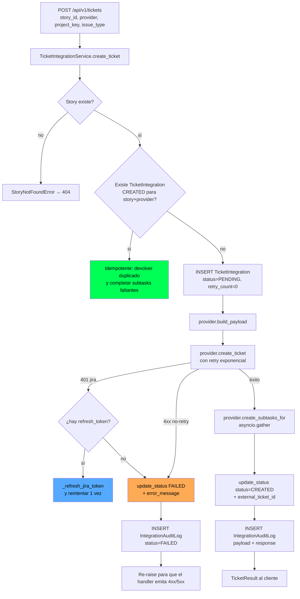
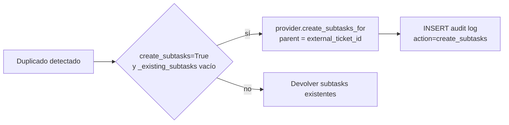
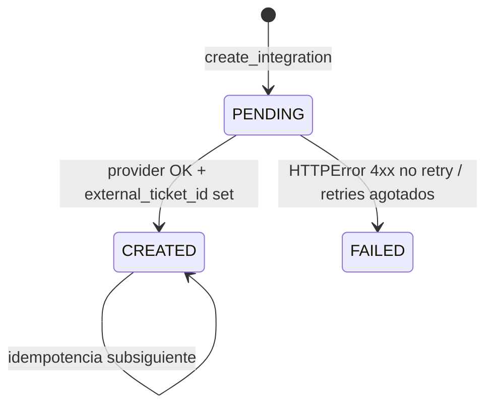
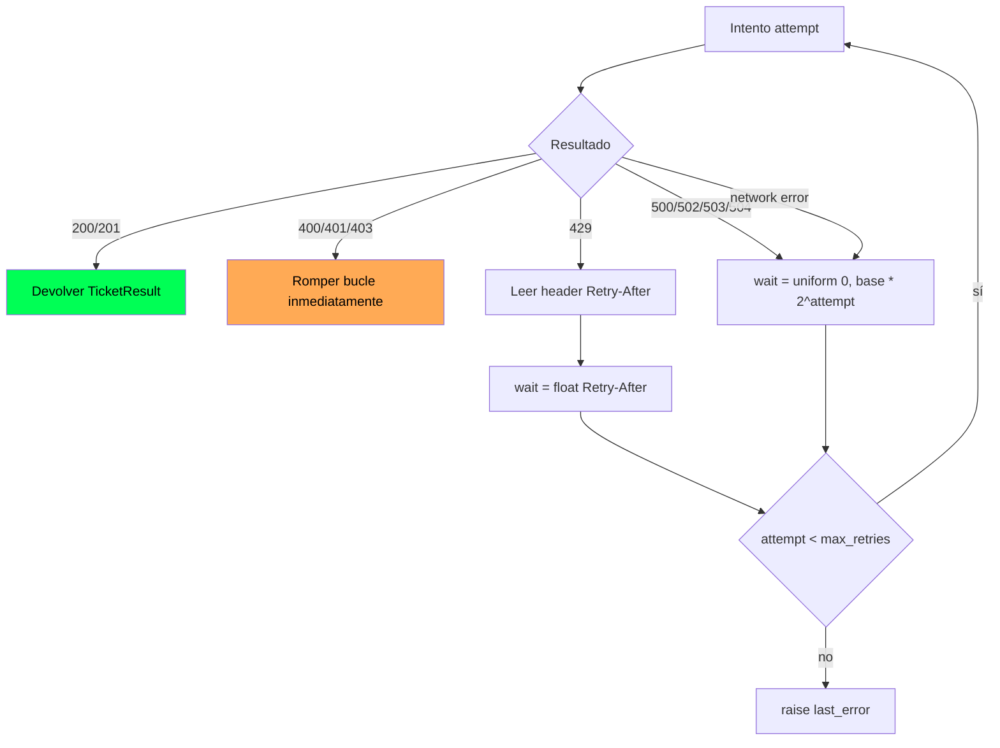

# Integración con sistemas de tickets (Jira / Azure DevOps)

Una vez generada una `UserStory` el usuario puede materializarla como ticket en Jira o como Work Item en Azure DevOps. La integración está diseñada como **idempotente, con retry exponencial**, **audit log con payload + response** y desacoplada del proveedor concreto detrás de un ABC. Las subtareas (frontend / backend / configuration) se crean en paralelo y enlazadas al padre.

> Para autenticación de usuario ver [`auth.md`](./auth.md). Para conexiones SCM y OAuth (Jira reutiliza el mismo flujo) ver [`integraciones-scm.md`](./integraciones-scm.md). Para arquitectura general ver [`../arquitectura.md`](../arquitectura.md). Para tablas `ticket_integrations` y `integration_audit_logs` ver [`../db.md`](../db.md).

---

## 1. Visión general



Componentes:

| Pieza | Archivo | Responsabilidad |
|---|---|---|
| `TicketIntegrationService` | `app/services/ticket_integration_service.py` | Orquestador: idempotencia, refresh OAuth, audit log |
| `TicketProvider` ABC | `app/services/ticket_providers/base.py` | Contrato: `create_ticket`, `get_ticket`, `validate_connection`, `build_payload`, `create_subtasks_for` |
| `JiraTicketProvider` | `app/services/ticket_providers/jira.py` | Cliente OAuth Jira Cloud + retry + ADF |
| `AzureDevOpsTicketProvider` | `app/services/ticket_providers/azure_devops.py` | Cliente Azure DevOps + retry + child work items |
| `JiraOAuthProvider` | `app/services/ticket_providers/jira_oauth.py` | Solo OAuth (authorize/exchange/refresh/list_sites). Lo usan SCM y este servicio |
| `TicketIntegrationRepository` | `app/repositories/ticket_integration_repository.py` | Idempotencia por `(tenant, story, provider, status=CREATED)` y métricas |
| `app/api/routes/ticket_integration.py` | Endpoint, mapeo de excepciones a status HTTP |

---

## 2. Idempotencia

La idempotencia se aplica con una consulta a `ticket_integrations` antes de cualquier llamada al proveedor:

```python
existing = self._integration_repo.find_by_story_and_provider(story_id, provider_name)
# WHERE tenant_id = :tid
#   AND story_id = :sid
#   AND provider = :provider
#   AND status   = 'CREATED'
```

Si existe → se devuelve el ticket original sin volver a llamar al proveedor. La respuesta lleva `status="DUPLICATE"` y la URL externa reconstruida (`/browse/{key}` para Jira, `/_workitems/edit/{id}` para Azure DevOps). El frontend usa eso para mostrar "ya existe" sin tratar como error.

### 2.1 Subtasks completables tras un duplicado

Si la historia tiene subtasks pero el ticket original se creó **sin** ellas (porque la primera vez `create_subtasks=False`), una segunda llamada con `create_subtasks=True` **sí** crea las subtasks faltantes y enlaza al padre existente:



`_existing_subtasks` lee `IntegrationAuditLog` (no `ticket_integrations`) buscando la última entrada `create_ticket` o `create_subtasks` con `status=CREATED` y extrae sus IDs/URLs/titles del JSON `response`. Por eso las subtasks **no necesitan** una tabla propia — el audit log es la fuente de verdad operativa.

### 2.2 Estados de `ticket_integrations.status`



`PENDING` solo aparece dentro del request — se reemplaza por `CREATED` o `FAILED` antes de devolver al cliente. Si el proceso muere antes de actualizar (caso raro), queda una fila `PENDING` huérfana que **no** dispara la idempotencia (porque el filtro pide `status=CREATED`); el reintento del usuario crea otra fila desde cero. No hay job de limpieza de `PENDING` huérfanos.

---

## 3. Retry exponencial con `Retry-After`

Cada provider implementa su propio loop. La política es la misma:

```python
def _backoff_seconds(attempt: int, base_delay: int, retry_after: str | None = None) -> float:
    if retry_after:
        try:
            return float(retry_after)  # respeta el header
        except ValueError:
            pass
    cap = base_delay * (2 ** attempt)
    return random.uniform(0, cap)  # jitter [0, cap]
```

Es **exponential backoff con full jitter**: cada intento espera un valor aleatorio entre 0 y `base_delay * 2^attempt`. Si el servidor mandó `Retry-After`, ese header gana sobre el cálculo. Eso evita el efecto manada cuando muchos clientes saturan al mismo tiempo.



### 3.1 Qué se reintenta vs qué no

| Caso | ¿Reintenta? | Motivo |
|---|---|---|
| 400 Bad Request | **No** | Payload inválido — reintentar no lo arregla |
| 401 Unauthorized | **No** *(salvo Jira con refresh; ver §4.2)* | Token expirado/revocado |
| 403 Forbidden | **No** | Permisos insuficientes |
| 429 Too Many Requests | **Sí** | Respeta `Retry-After` si está presente |
| 5xx server error | **Sí** | Transitorio del lado del proveedor |
| `httpx.RequestError` (timeout, DNS, conn reset) | **Sí** | Red flaky |

`max_retries` y `base_delay` provienen de `Settings`:

| Provider | Variable max | Variable delay base |
|---|---|---|
| Jira | `JIRA_MAX_RETRIES` (default 3) | `JIRA_RETRY_DELAY_SECONDS` (default 5) |
| Azure DevOps | `AZURE_MAX_RETRIES` (default 3) | `AZURE_RETRY_DELAY_SECONDS` (default 5) |

El bucle hace `max_retries + 1` intentos en total. Con los defaults y jitter, el peor caso son ~3 esperas de hasta 5s, 10s y 20s respectivamente — el wall time vive entre `0` y `~35s` antes del fallo final.

### 3.2 Subtasks: retry independiente

Cada subtask se crea con `_create_one_subtask` que tiene su **propio** loop de retry idéntico. El conjunto entero se ejecuta con `asyncio.gather(*coros)` — todas las subtasks corren en paralelo. Si una falla definitivamente, queda en `failed_subtasks` con su título completo (`[Frontend] ...`) y se devuelve al frontend para que el usuario sepa qué reintentar manualmente.

`retry_count` en la tabla `ticket_integrations` **no se incrementa** durante esos reintentos — esa columna queda en 0 para el primer intento de creación. La métrica real de reintentos vive en los logs estructurados (`jira_create_ticket_retryable_error` con `attempt`).

---

## 4. Construcción de payload por proveedor

### 4.1 Jira (`JiraTicketProvider`)

| Aspecto | Detalle |
|---|---|
| Endpoint | `POST {base_url}/rest/api/3/issue` |
| Auth | Bearer OAuth (token de `source_connections.access_token` con `platform=jira`) |
| `base_url` | API base del site (`{cloudId}.atlassian.net/...`); validada con `validate_instance_url` |
| `site_url` | `https://acme.atlassian.net` para construir URLs `/browse/...` que el usuario abre |
| Descripción | Atlassian Document Format (ADF) — JSON anidado con `paragraph`, `heading`, `bulletList` |
| Issue type | Mapeable vía `JIRA_ISSUE_TYPE_MAP` |
| Subtasks | Issue type `Subtask` con campo `parent.key`; en paralelo |

#### Issue type aliases

`JIRA_ISSUE_TYPE_MAP` permite mapear nombres canónicos a los del proyecto Jira destino, útil para proyectos no-EN:

```env
JIRA_ISSUE_TYPE_MAP=Story=Historia,Task=Tarea,Bug=Error,Subtask=Subtarea
```

`_resolve_issue_type` busca primero por nombre canónico, luego por alias case-insensitive. Si no hay match, devuelve el valor recibido tal cual — un proyecto en inglés sin mapping configurado funciona con `Story` literal.

`_ISSUE_TYPE_ALIASES` (en código) reconoce además: `historia`, `tarea`, `error`, `defect`, `subtarea` etc. para coincidencia automática sin necesidad de configurar el map en muchos casos.

### 4.2 Refresh OAuth de Jira

Cuando el `access_token` de Jira expira el provider responde 401. El servicio detecta este caso **específicamente** y lo distingue de los otros 401:

```python
except HTTPError as exc:
    if exc.code == 401 and provider_name == "jira":
        new_token = self._refresh_jira_token()
        if new_token:
            provider = self._get_provider(provider_name, access_token_override=new_token)
            result = await provider.create_ticket(story, project_key, issue_type)
        else:
            raise
    else:
        raise
```

`_refresh_jira_token()`:

1. Lee `source_connections.refresh_token` para `platform=jira`.
2. Si no hay refresh → `None` → propaga el 401 original.
3. Si hay → llama a `JiraOAuthProvider.refresh_access_token(...)` con `client_id`/`client_secret`.
4. Persiste el nuevo `access_token` (y `refresh_token` si vino renovado).
5. Devuelve el nuevo token; el llamante reconstruye el provider y reintenta **una sola vez**.

Si el reintento falla de nuevo, **no** hay segundo refresh — propaga el error. Esto evita loops por un refresh válido pero un proyecto sin permisos.

### 4.3 Azure DevOps (`AzureDevOpsTicketProvider`)

| Aspecto | Detalle |
|---|---|
| Endpoint | `POST {org_url}/{project}/_apis/wit/workitems/${issue_type}?api-version=7.1` |
| Auth | Basic con PAT, o Bearer con OAuth — depende de `auth_method` |
| `org_url` | Derivado de `source_connections.base_url` (PAT) o de `boards_project="org/project"` (OAuth) |
| Body | JSON Patch (`[{"op":"add", "path":"/fields/System.Title", "value":...}]`) |
| Subtasks | Work items hijos linkeados con `System.LinkTypes.Hierarchy-Reverse` al padre |
| Process template | Algunos templates usan tipos custom; `get_project_process` permite descubrirlos |

`_resolve_azure_conn` es el punto delicado: localiza una conexión `azure_devops` activa (o la última con `boards_project` configurado) y deriva `(access_token, org_url, project_name)`. Si el OAuth no persistió `base_url`, lo reconstruye desde `boards_project="org/project"` como `https://dev.azure.com/{org}`. Si nada cuadra → `ProviderNotConfiguredError` → `400` al cliente.

---

## 5. Auditoría: `IntegrationAuditLog`

Cada llamada (éxito o fallo) escribe una fila:

```python
self._audit(
    story_id=...,
    provider=...,
    action="create_ticket" | "create_subtasks",
    payload=<dict del request>,    # JSON-serialized
    response=<dict del response>,  # JSON-serialized
    status="CREATED" | "FAILED",
)
```

Tabla `integration_audit_logs` (ver [`../db.md`](../db.md)):

- **`payload`** — el body que se mandó al proveedor. Para Jira es el ADF completo. Útil para reproducir un 400 contra `curl` directamente.
- **`response`** — `{external_id, url, subtask_ids, subtask_urls, subtask_titles}` en éxito, o `{error, status_code, jira_error_body}` en fallo.
- **`timestamp`** — UTC, indexable.

### Cómo leer el audit log para debug

```sql
SELECT timestamp, action, status, payload, response
FROM integration_audit_logs
WHERE tenant_id = :tid AND story_id = :sid
ORDER BY timestamp DESC
LIMIT 20;
```

Patrones típicos:

| Síntoma | Qué buscar |
|---|---|
| Usuario reporta "no se creó el ticket" | Última fila con `status=FAILED`. `response.error` contiene `HTTP {code}: {reason}`. Para Jira, `response.jira_error_body` trae `{errors: {project: "..."}}` |
| Subtasks faltantes | Comparar `payload.fields.subtasks` (cantidad) vs `response.subtask_ids` (cantidad). Diferencia ≠ 0 → revisar `failed_subtasks` |
| Ticket duplicado pero el cliente quería reintentar | `find_by_story_and_provider` devolvió la fila vieja. Para forzar nuevo ticket: borrar la fila `CREATED` original (fuera del scope del producto, requiere acceso a BD) |
| Loop de 401 | Buscar `jira_token_refresh_failed` en logs estructurados (no en BD). Causa típica: `refresh_token` invalidado por reset de password |

`get_audit_logs(story_id)` en el endpoint expone esto al frontend con orden DESC y sin límite. El dashboard de la historia muestra el árbol cronológico.

---

## 6. Auth para tickets

| Plataforma | Métodos | Cómo se almacena |
|---|---|---|
| Jira | OAuth (recomendado) | `source_connections.platform="jira"`, `access_token` + `refresh_token` cifrados, `base_url=<api_base>`, `repo_full_name=<site_url>` |
| Jira (legacy) | API Token + email | `auth_method="pat"`, email pasado en el form de PAT |
| Azure DevOps | OAuth | `boards_project="org/project"` |
| Azure DevOps | PAT | `auth_method="pat"`, `base_url="https://dev.azure.com/{org}"` |

Nota: Jira reutiliza `JiraOAuthProvider` (registrado en `app/services/scm_providers/__init__.py`) para `authorize_url`, `exchange_code`, `refresh_access_token`, `list_sites`. Es el mismo flujo OAuth descrito en [`integraciones-scm.md`](./integraciones-scm.md). La elección del *site* se hace tras el OAuth con `activate_site` (multi-tenancy de Jira: una cuenta puede tener acceso a varios sites).

---

## 7. Health check

`POST /api/v1/tickets/health` (o el endpoint equivalente, ver `app/api/routes/ticket_integration.py`) llama a `TicketIntegrationService.health_check()`:

```python
{
    "jira": "healthy" | "unhealthy" | "not_configured",
    "azure_devops": "healthy" | "unhealthy" | "not_configured",
}
```

Para cada provider:

- Lee la conexión activa.
- Si no existe / falta token → `"not_configured"`.
- Si existe → llama `provider.validate_connection()` (típicamente `GET /myself` en Jira o equivalente en Azure).
- Excepción → `"unhealthy"`.

Sirve para que el frontend pinte el indicador en el dashboard de Conexiones sin tocar la BD del usuario.

---

## 8. Modos de fallo

| Caso | Status HTTP del cliente | Mensaje en BD / log |
|---|---|---|
| `story_id` inexistente | 404 | `StoryNotFoundError: UserStory '...' not found` |
| `provider` no soportado | 400 | `UnsupportedProviderError: Provider '...' is not supported. Available: ['jira', 'azure_devops']` |
| Provider no configurado (sin conexión activa) | 400 | `ProviderNotConfiguredError: <plataforma> is not configured...` |
| 400 del proveedor (proyecto inválido, issue_type que no existe) | 4xx propagado | `error_message = "HTTP 400: Bad Request — {jira_error_body}"`. Audit `status=FAILED` |
| 401 Jira sin refresh_token | 401 propagado | El usuario debe reconectar Jira |
| 401 Jira con refresh, pero el refresh también falla | 401 propagado | `jira_token_refresh_failed` en logs |
| 403 (permisos) | 403 propagado | Audit con `response.error` |
| 429 sostenido más allá de `JIRA_MAX_RETRIES` | El último error 429 se re-lanza | Subir `JIRA_MAX_RETRIES` o reducir tasa |
| 5xx persistente | 5xx tras agotar retries | Audit con `response.status_code=5xx` |
| Subtask individual falla pero el padre se creó | 200 al cliente con `failed_subtasks=[...]` | El usuario ve qué subtasks quedaron pendientes |
| Issue type del payload no encaja con la plantilla del proyecto | 400 con `jira_error_body` indicando el campo | Configurar `JIRA_ISSUE_TYPE_MAP` o cambiar `issue_type` en la request |

---

## 9. Runbook breve

### "Falló la creación del ticket de la historia X"

1. Pedir al usuario el `story_id` (visible en la URL del frontend o en el dashboard).
2. Consultar audit log: `SELECT * FROM integration_audit_logs WHERE story_id = :sid ORDER BY timestamp DESC LIMIT 10;`.
3. Mirar la última fila `status=FAILED`, leer `response.error` y `response.jira_error_body`.
4. Acciones según el caso:
    - 400 con `errors.project`: el `project_key` no existe en el site activo. El usuario debe re-elegir proyecto en Conexiones.
    - 400 con `errors.issuetype`: ajustar `JIRA_ISSUE_TYPE_MAP` y reiniciar el API (la `Settings` está cacheada con `@lru_cache`).
    - 401 sin refresh: el usuario reconecta Jira en Conexiones → Herramientas de gestión.
    - 5xx: reintentar; si persiste, ir al status page de Atlassian/Microsoft.

### "El ticket se creó pero las subtasks no"

1. Audit log debe tener una fila `action=create_ticket` con `status=CREATED` y otra/s `action=create_subtasks` (puede haber `CREATED` o `FAILED`).
2. `failed_subtasks` en `response` lista los títulos que no se crearon.
3. El frontend permite reintentar la creación de ticket — la idempotencia evita duplicar el padre y solo crea las subtasks faltantes.

### "El ticket se duplicó"

Imposible con la idempotencia activa: el filtro `status=CREATED` corta antes de la llamada al proveedor. Si pasó, mirar:

- ¿Se borró manualmente la fila `ticket_integrations` antes del segundo intento?
- ¿El segundo intento usó `provider` distinto (Jira y Azure DevOps son silos independientes)?

---

## 10. Resumen para extender a un proveedor nuevo

1. Crear `app/services/ticket_providers/<nuevo>.py` heredando `TicketProvider`. Implementar `create_ticket`, `get_ticket`, `validate_connection`, `build_payload`, `create_subtasks_for`.
2. Implementar `_backoff_seconds` siguiendo el patrón (jitter + `Retry-After`).
3. Registrar la clase en `_PROVIDERS` de `ticket_integration_service.py`.
4. Si necesita conexión persistida, añadir el branch correspondiente en `_get_provider` que la lea del `SourceConnectionRepository`.
5. Si el proveedor tiene OAuth con refresh, replicar el patrón `_refresh_jira_token` (lee `refresh_token`, intercambia, persiste, reintenta una vez).
6. Añadir variables `<NUEVO>_MAX_RETRIES`, `<NUEVO>_RETRY_DELAY_SECONDS`, `<NUEVO>_REQUEST_TIMEOUT_SECONDS` a `Settings`.
7. Añadir un branch en `_duplicate_url` para construir la URL de un duplicado sin volver a llamar al proveedor.
8. Tests: stub del proveedor que simule 200, 400, 429 con `Retry-After`, 5xx y network errors. Verificar que el audit log refleja cada uno.
