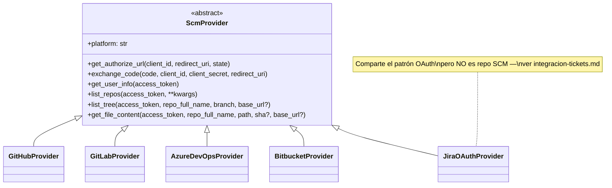
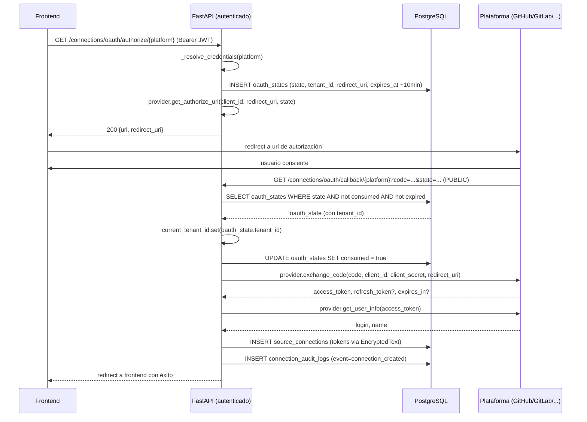
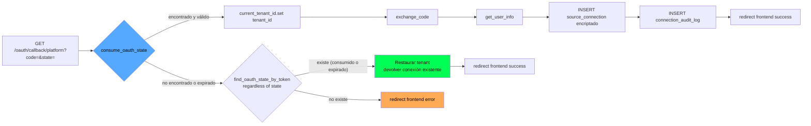
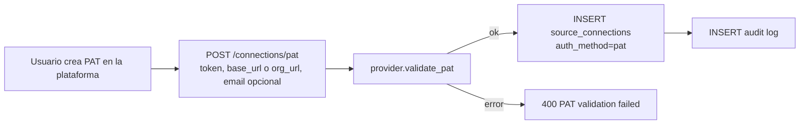
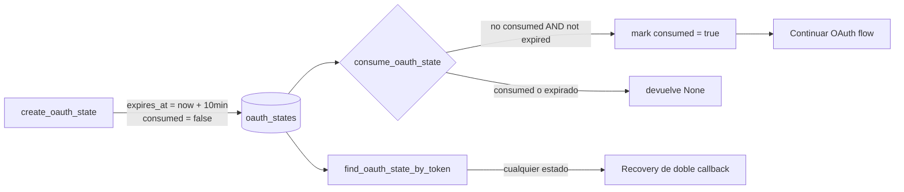

# Integraciones SCM (GitHub, GitLab, Azure Repos, Bitbucket)

BridgeAI conecta el repositorio del usuario para indexar su código y alimentar el pipeline de IA. Soporta cuatro plataformas Git (GitHub, GitLab, Azure Repos, Bitbucket) y dos métodos de autenticación (OAuth y PAT) detrás del mismo patrón ABC. Los tokens se cifran con Fernet en BD, las conexiones se *soft-delete*-an para preservar trazabilidad y todo evento queda registrado en un audit log.

> Para autenticación de usuario (Auth0) ver [`auth.md`](./auth.md). Para integraciones de tickets (Jira / Azure DevOps) ver [`integracion-tickets.md`](./integracion-tickets.md). Para arquitectura general ver [`../arquitectura.md`](../arquitectura.md). Para tablas `source_connections`, `oauth_states`, `connection_audit_logs` ver [`../db.md`](../db.md).

---

## 1. Visión general



| Provider | `platform` | URL base API | Notas |
|---|---|---|---|
| `GitHubProvider` | `github` | `https://api.github.com` (o `<host>/api/v3` self-hosted) | Sin refresh token (PAT clásico); fine-grained PAT omiten `X-OAuth-Scopes` |
| `GitLabProvider` | `gitlab` | `https://gitlab.com/api/v4` (o self-hosted vía `base_url`) | Soporta refresh token |
| `AzureDevOpsProvider` | `azure_devops` | `https://dev.azure.com/{org}` (vía `org_url`) | Project-aware, usa `org_url` en kwargs |
| `BitbucketProvider` | `bitbucket` | `https://api.bitbucket.org/2.0` | Workspace en path, sin self-hosted en este registry |
| `JiraOAuthProvider` | `jira` | Multi-site (cloudId + api_base_url) | Comparte el ABC pero se usa para tickets, no SCM |

`SCM_PLATFORMS = {"github", "gitlab", "azure_devops", "bitbucket"}` — el set que cuenta como "repositorio". Jira está registrado en `_PROVIDERS` por compartir el flujo OAuth, pero no participa en indexación.

`SUPPORTED_PLATFORMS = list(_PROVIDERS.keys())` — la fuente de verdad la mantiene el `__init__.py` del módulo.

---

## 2. Flujo OAuth genérico

**Archivo orquestador**: `app/services/source_connection_service.py`. **Endpoints**: `app/api/routes/connections.py`.



### 2.1 Initiate (paso autenticado)

`GET /api/v1/connections/oauth/authorize/{platform}` requiere JWT (Auth0). El handler:

1. Resuelve `client_id`/`client_secret` del proveedor desde `Settings`. Si no están configurados, devuelve `400 Platform 'X' is not configured`.
2. Genera un `state` UUID v4.
3. Persiste `OAuthState(tenant_id, platform, state_token, redirect_uri, expires_at = now + 10min, consumed=False)` — el `tenant_id` viene del `ContextVar` poblado por Auth0.
4. Construye la URL de autorización del proveedor (cada uno tiene la suya: `_AUTHORIZE_URL` en GitHub, etc.).
5. Devuelve `{url, redirect_uri}` para que el frontend haga `window.location = url`.

### 2.2 Callback (paso público)

`GET /api/v1/connections/oauth/callback/{platform}?code=...&state=...` **no** valida JWT — la plataforma externa no lo manda. Esto es seguro porque:

- El `state` es desconocido por terceros (UUID v4, persistido tras un paso autenticado).
- El `tenant_id` se recupera **del registro `OAuthState` en BD**, no del request — un atacante no puede inyectar `tenant_id` por query string.
- `consume_oauth_state` lo marca como `consumed=True` en la misma transacción que lo lee, evitando reuso.



### 2.3 Doble callback idempotente

Browsers, proxies y navegación con back-button pueden disparar el callback dos veces. La primera consume el `state`; la segunda no lo encuentra como vivo. En lugar de mostrar error, el código:

1. Lo busca con `find_oauth_state_by_token` (ignora `consumed`/`expires_at`).
2. Recupera el `tenant_id` y lo setea en el `ContextVar`.
3. Devuelve la conexión más reciente para esa plataforma con `find_latest_for_platform`.

Solo si el `state` no existe en absoluto (falsificado, viejísimo) se rechaza.

---

## 3. Particularidades por proveedor

| Aspecto | GitHub | GitLab | Azure Repos | Bitbucket |
|---|---|---|---|---|
| `repo_full_name` | `owner/repo` | `group/subgroup/repo` | `org/project/repo` | `workspace/repo` |
| Soporte self-hosted | Sí (`base_url`, `/api/v3`) | Sí (`base_url`) | No (siempre `dev.azure.com/{org}` vía `org_url`) | No (solo `bitbucket.org`) |
| Refresh token | No (clásico) | Sí | Sí | Sí |
| Scopes OAuth | `repo read:user` | `read_api read_user read_repository` | Azure-específico | `repository:read account:read` |
| Project layer | Plano (owner/repo) | Plano (group/repo) | **Sí** — project es nivel propio entre org y repo | Plano (workspace/repo) |
| Identificador de cambio | `sha` (blob SHA) | `sha` (blob SHA) | `objectId` | `hash` |

### 3.1 Self-hosted (`base_url`)

Para GitHub Enterprise / GitLab self-hosted / Bitbucket DC, el cliente PAT envía `base_url`. **No** se acepta cualquier URL: `validate_instance_url()` rechaza:

- Esquemas distintos a `http`/`https`.
- IPs privadas, loopback, link-local o reserved (anti-SSRF).

Limitación conocida: la validación es por IP literal en el host. **No** previene DNS rebinding (eso requiere resolver el host en el momento de la conexión real). Si esto se vuelve un riesgo serio, hay que añadir resolución y comparación a nivel de socket.

### 3.2 Azure DevOps (`org_url`)

Azure tiene tres niveles: organization → project → repo. El `SourceConnectionService.list_repos` distingue:

```python
if conn.platform == "azure_devops" and conn.base_url:
    kwargs["org_url"] = conn.base_url
elif conn.platform in ("github", "gitlab", "bitbucket") and conn.base_url:
    kwargs["base_url"] = conn.base_url
```

`org_url` viaja como kwarg distinto en azure_devops; `base_url` para los demás. La razón: el ABC define `list_repos(access_token, **kwargs)` con kwargs flexibles porque cada proveedor consume su propio sabor. Toda esa traducción vive **únicamente** en el service; los providers reciben lo que esperan.

---

## 4. PAT como alternativa

`POST /api/v1/connections/pat` — método autenticado para usuarios que prefieren no pasar por OAuth. Cada provider expone `validate_pat(token, **kwargs)` que:

1. Llama a `/user` o equivalente con el PAT.
2. Devuelve `{login, name}` igual que `get_user_info`.
3. Lanza `ValueError` si el token es inválido.

Particularidades:

- **GitHub clásico** → header `X-OAuth-Scopes` para verificar que tiene `repo` y `read:user`. Los fine-grained PATs no exponen el header, así que se acepta sin verificar scope.
- **Jira** → requiere `email` además de `token` (Basic Auth: email + API token).
- **Azure DevOps** → requiere `org_url`.
- **Bitbucket** → en el momento de redactar este doc no tiene OAuth en `_get_server_credentials`; PAT es el único camino.

`auth_method` se persiste como `"pat"` en lugar de `"oauth"`. La diferencia operativa: **no hay refresh token**. Cuando expira, el usuario reconecta.



---

## 5. Encriptación Fernet de tokens

**Archivos**: `app/database/encrypted_types.py` (canónico), `app/core/encryption.py` (re-export por compatibilidad).

```python
class EncryptedText(TypeDecorator):
    impl = Text
    cache_ok = True

    def process_bind_param(self, value, dialect):
        # cifra antes de INSERT/UPDATE
        ...

    def process_result_value(self, value, dialect):
        # descifra al SELECT
        ...
```

`access_token` y `refresh_token` en `source_connections` están declarados como `EncryptedText`. SQLAlchemy llama `process_bind_param` antes de cada `INSERT`/`UPDATE` y `process_result_value` después de cada `SELECT`. El servicio nunca ve el texto cifrado.

### 5.1 La clave

`Settings.FIELD_ENCRYPTION_KEY` — string base64 generado con:

```bash
python -c "from cryptography.fernet import Fernet; print(Fernet.generate_key().decode())"
```

`_fernet()` está cacheada con `@lru_cache(maxsize=1)`: la clave se lee una vez por proceso. Cambiarla requiere reiniciar.

### 5.2 Comportamiento sin clave

Si `FIELD_ENCRYPTION_KEY=""`:

- `process_bind_param` registra `WARNING` y guarda el valor **en plano**.
- `process_result_value` devuelve el valor tal cual.
- La app sigue funcionando — esto permite *zero-downtime rollout*: setear la clave primero, luego correr la migración que cifra los valores existentes (`b5e2c3d4f901_encrypt_token_fields`).

`app/main.py` valida en `create_app()` que `FIELD_ENCRYPTION_KEY` esté presente cuando `APP_ENV=prod`. En prod la app **no arranca** sin clave.

### 5.3 Modo de fallo: token cifrado con clave anterior

Si la BD tiene tokens cifrados con una clave A pero el proceso arranca con una clave B:

- `Fernet.decrypt` lanza `InvalidToken`.
- `process_result_value` registra `WARNING` y devuelve el valor cifrado tal cual (un blob inservible).
- Las llamadas al proveedor SCM fallarán con 401, el usuario verá `Connection ... not found or not authenticated.`

**Implicación**: perder `FIELD_ENCRYPTION_KEY` invalida todas las conexiones existentes. No hay rotación implementada — eso es deuda técnica conocida. Hoy la única recuperación es: el usuario reconecta cada plataforma.

---

## 6. Anti-replay con `OAuthState`

**Modelo**: `app/models/oauth_state.py`. **Repositorio**: `SourceConnectionRepository.create_oauth_state` / `consume_oauth_state` / `find_oauth_state_by_token`.



| Campo | Restricción / lógica |
|---|---|
| `state_token` | UUID v4, `UNIQUE` en BD |
| `expires_at` | `now + 10min` (`_OAUTH_STATE_TTL_MINUTES = 10`) |
| `consumed` | `false` al crear; `true` tras primer consumo válido |
| `redirect_uri` | Persistido para reproducir el `redirect_uri` exacto en `exchange_code` (algunas plataformas lo requieren igual al de `authorize`) |
| `tenant_id` | Crítico: es la única forma de recuperar el contexto en el callback público |

No hay un job de limpieza de `oauth_states` viejos. La tabla crece linealmente con el número de inicios de OAuth fallidos o abandonados — un cron de limpieza es deuda menor (ver `expires_at < now - 24h`).

---

## 7. Soft-delete y audit log

### 7.1 Soft-delete

`SourceConnection.deleted_at` (timestamp nullable). `repo.delete(connection_id)`:

1. **Borra duro** los `code_files` e `impacted_files` de esa conexión — el índice del repo se va para liberar espacio y para que reactivar la misma conexión empiece limpia.
2. **Marca** `deleted_at = now`.
3. Las historias, requerimientos, análisis, ticket integrations y audit logs **conservan** su `source_connection_id` con FK al registro soft-deleted, así que siguen siendo trazables.

Filtro `_alive()` (`SourceConnection.deleted_at.is_(None)`) se aplica en todas las consultas de listado/lookup, así que un `find_by_id` jamás devuelve una conexión borrada.

### 7.2 Audit log

`connection_audit_logs.connection_id` es **`String(36)` plano**, no FK. Esto es deliberado: si alguna vez se decide hacer hard-delete (ej. cumplimiento GDPR de borrado total), el audit log sobrevive sin violación de integridad referencial.

Eventos registrados (`SourceConnectionService.log_event`):

| `event` | Cuándo |
|---|---|
| `connection_created` | Tras `handle_callback` o `create_pat_connection` exitoso |
| `repo_activated` | Tras `activate_repo`, con `detail = {"repo": ..., "branch": ...}` |
| `connection_deleted` | Antes del soft-delete |

`actor` guarda `display_name` en el momento del evento, no es FK al usuario — sobrevive a renames y a borrados de cuenta.

---

## 8. Aislamiento por conexión

Cada `SourceConnection` define un scope de aislamiento más fino que el tenant. Un mismo tenant con N conexiones tiene N silos paralelos de `code_files`, `requirements`, `impact_analysis`, `user_stories`. Ver detalles en [`../arquitectura.md`](../arquitectura.md) §4 y los `UNIQUE`/índices de [`../db.md`](../db.md).

Implicación operativa: **cambiar de repo activo no contamina el anterior**. Activar un repo:

```python
def activate(connection_id, repo_full_name, repo_name, owner, default_branch):
    # 1. Desactiva el resto de conexiones SCM (no las de tickets)
    UPDATE source_connections SET is_active=false
        WHERE platform IN _SCM_PLATFORMS AND is_active=true
    # 2. Activa esta y persiste repo_full_name, repo_name, owner, default_branch
```

Al desactivar otra conexión, su índice **no se borra** — solo deja de ser la activa. Si el usuario vuelve a activarla, encuentra los archivos donde los dejó.

---

## 9. Modos de fallo

| Caso | Comportamiento | Diagnóstico |
|---|---|---|
| `client_id`/`client_secret` no configurados para la plataforma | `400 Platform 'X' is not configured. Set server-side credentials in .env.` | Verificar `<PLATFORM>_CLIENT_ID/_SECRET` en `.env` |
| `state` desconocido o doble click sin estado previo | Redirect al frontend con error | Logs: `OAuth callback error platform=X error=...` |
| `state` ya consumido (doble callback) | Recovery: devuelve la conexión existente | Logs: `OAuth duplicate callback platform=X — returning existing connection` |
| `exchange_code` falla (4xx o red) | `400 OAuth token exchange failed. Please try again.` (con log original) | Causa típica: `redirect_uri` no autorizado en la plataforma, o `client_secret` rotado |
| `validate_pat` falla | `400 PAT validation failed: <razón>` | Probar PAT con `curl` manual al endpoint del proveedor |
| Usuario revoca el token desde la plataforma externa | `list_repos`/`list_tree` devuelven 401 | `connection.access_token` ya es inválido; el usuario debe reconectar — soft-delete recomendado |
| Token Jira expirado pero hay `refresh_token` | `_refresh_jira_token`: intercambia y persiste el nuevo access_token automáticamente | Logs: `Jira token refreshed connection=X` |
| Token expirado sin `refresh_token` (PAT, GitHub clásico) | `Jira token expired and no refresh token is available — please reconnect.` | Reconectar la conexión |
| `FIELD_ENCRYPTION_KEY` perdida o rotada sin migración | Tokens devueltos como blobs cifrados; llamadas SCM fallan con 401 | Logs: `WARNING Unencrypted token found in DB...` o errores 401 sin causa aparente |
| Repo borrado en la plataforma externa | `list_tree` lanza error; el usuario ve `Failed to fetch <path>` en logs de indexación | Reactivar otro repo o recrear el remoto |
| `base_url` apunta a IP privada | `ValueError("Instance URL points to a disallowed IP range")` | Usar hostname público o resolver el caso vía whitelist en el deployment |

---

## 10. Configuración de credenciales OAuth

Cada plataforma necesita su par client_id / client_secret en `.env`:

```env
GITHUB_CLIENT_ID=...
GITHUB_CLIENT_SECRET=...
GITLAB_CLIENT_ID=...
GITLAB_CLIENT_SECRET=...
AZURE_DEVOPS_CLIENT_ID=...
AZURE_DEVOPS_CLIENT_SECRET=...
BITBUCKET_CLIENT_ID=...
BITBUCKET_CLIENT_SECRET=...
JIRA_CLIENT_ID=...
JIRA_CLIENT_SECRET=...
```

`SourceConnectionService.list_platforms()` reporta `server_configured: bool` por plataforma: el frontend usa eso para mostrar/ocultar los botones OAuth. Si `client_id` o `client_secret` está vacío → `server_configured=false` → solo PAT disponible.

`API_BASE_URL` se usa para construir `redirect_uri = {API_BASE_URL}/api/v1/connections/oauth/callback/{platform}`. **Esa cadena exacta** debe estar registrada como callback URL autorizada en cada app OAuth de cada plataforma. Cambiar de host (dev → staging → prod) requiere registrar tres callbacks o usar tunelización con un host estable.

---

## 11. Resumen para extender a una plataforma nueva

1. Crear `app/services/scm_providers/<nueva>.py` heredando de `ScmProvider`. Implementar los 6 métodos abstractos.
2. Si soporta self-hosted, llamar `validate_instance_url(base_url)` antes de hacer cualquier request.
3. Registrar la instancia en `app/services/scm_providers/__init__.py` (`_PROVIDERS` + `SCM_PLATFORMS` si aplica).
4. Añadir `<NUEVA>_CLIENT_ID` / `<NUEVA>_CLIENT_SECRET` a `Settings`.
5. Añadir mapping en `_get_server_credentials` y `_PLATFORM_LABELS` de `SourceConnectionService`.
6. Si tiene capa intermedia tipo Azure project, añadir el kwarg correspondiente en el switch de `list_repos`.
7. Si soporta PAT, implementar `validate_pat(token, **kwargs)` y, si necesita campos extra, ampliar `PATConnectRequest` en `connections.py`.
8. Si soporta refresh, añadir `refresh_access_token(refresh_token, client_id, client_secret)` y un método `_refresh_<plat>_token` en el service.
9. Tests unitarios con un fake del API de la plataforma.
10. Registrar la callback URL `{API_BASE_URL}/api/v1/connections/oauth/callback/<platform>` en la app OAuth del proveedor.
